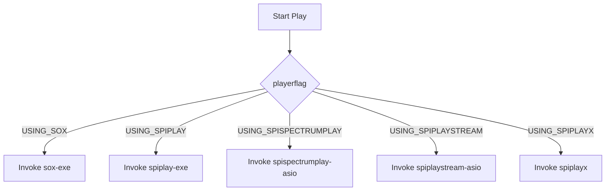

# External Tools and Configuration – External Audio Players

This section describes how **spiwavsetlib** delegates audio playback to external executables. Instead of streaming audio internally, the library launches command-line players via `ShellExecuteA` or `system`. All paths are currently **hard-coded**, so you must ensure these tools exist at the expected locations or adjust the source accordingly.

## Supported External Players 🎵

- **USING_SOX**

Play with [sox.exe], ideal for quick WAV playback with trimming.

- **USING_SPIPLAY**

Launch `spiplay.exe`, a custom player that accepts a filename and duration.

- **USING_SPISPECTRUMPLAY**

Invoke `spispectrumplay_asio.exe` for ASIO-based playback with spectrum visualization.

- **USING_SPIPLAYSTREAM**

Use `spiplaystream_asio.exe` for streaming ASIO playback.

- **USING_SPIPLAYX**

Alternative `spiplayx.exe` wrapper around `spiplay.exe`.

## Player Configuration Table

| **Flag** | **Executable** | **Default Path** | **Common Options** |
| --- | --- | --- | --- |
| **USING_SOX** | sox.exe | `C:\app-bin\sox\sox.exe` | `-q` (quiet), `-d trim 0 <seconds>` |
| **USING_SPIPLAY** | spiplay.exe | `C:\app-bin\spiplay\spiplay.exe` | `<filename> <duration>` |
| **USING_SPISPECTRUMPLAY** | spispectrumplay_asio.exe | `C:\app-bin\spispectrumplay_asio\spispectrumplay_asio.exe` | `<filename> <duration> 200 200 0 "E-MU ASIO" 6 7` |
| **USING_SPIPLAYSTREAM** | spiplaystream_asio.exe | `C:\app-bin\spiplaystream_asio\spiplaystream_asio.exe` | `<filename> <duration> "E-MU ASIO" 6 7` |
| **USING_SPIPLAYX** | spiplayx.exe | `C:\app-bin\spiplayx\spiplayx.exe` | same as spiplay |


## Invocation Workflow

Below is a simplified flow of how **WavSet::Play** chooses and launches an external tool:



This decision logic lives in **WavSet::Play** and asserts the flag is one of the supported ones before constructing and executing the command .

## Example Code Snippet

```cpp
// WavSet::Play excerpt for USING_SOX
char args[WAVSET_CHARNAME_MAXLENGTH];
sprintf_s(
  args, WAVSET_CHARNAME_MAXLENGTH-1,
  "%s \"%s\" -d trim 0 %f",
  charBuffer6,              // "-q" in release, "" in debug
  filename.c_str(),         // WAV file to play
  numberofsecondsinplayback // duration
);
ShellExecuteA(
  NULL, "open",
  "c:\\app-bin\\sox\\sox.exe",
  args,
  NULL,
  nShowCmd                 // 0 in release (/b for background), 1 in debug
);
```

This pattern repeats for each player flag, simply swapping the executable path and argument string .

## Release vs. Debug Modes

- In **release** builds:
- `charBuffer5 = "/b"` → launch in **background**.
- `charBuffer6 = "-q"` → run **quiet** mode (sox).
- `nShowCmd = 0` → hide console windows.
- In **debug** builds:
- Both buffers are empty (`""`).
- `nShowCmd = 1` → show console for troubleshooting .

## Best Practices & Troubleshooting 🚧

- **Verify Executable Paths**

Ensure each `.exe` exists under `C:\app-bin\…` or update the hard-coded paths in `spiws_WavSet.cpp`.

- **Permissions**

Grant the application permission to launch external processes and access the WAV files.

- **Customizing Paths**

Replace literal strings in:

```cpp
  ShellExecuteA(NULL, "open", "c:\\app-bin\\sox\\sox.exe", …);
```

with configurable variables or preprocessor macros for flexibility.

- **ASIO Device Names**

Tools like `spispectrumplay_asio` and `spiplaystream_asio` accept ASIO driver names and channel indices as arguments; adjust them to match your system setup .

---

By understanding these external dependencies and their invocation patterns, you can tailor **spiwavsetlib** to your environment and enable robust WAV playback and visualization.