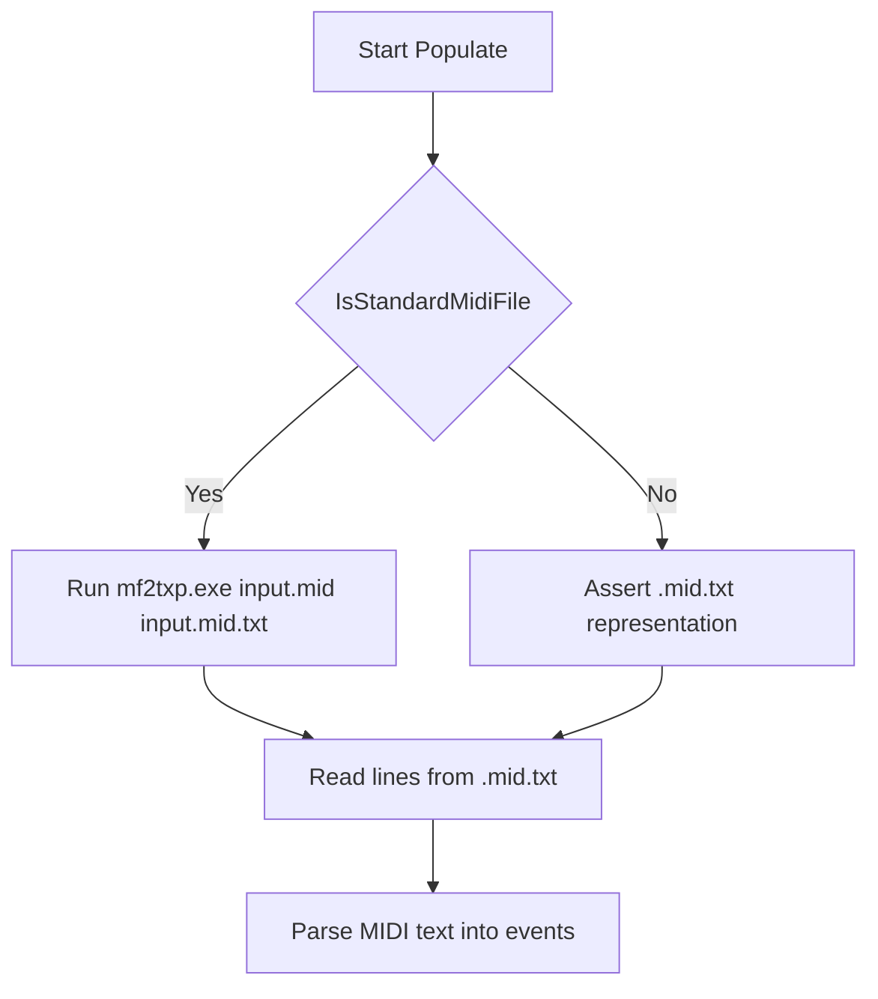

# External Tools and Configuration – MIDI File Conversion Tool

This section describes how the library handles standard MIDI files (`.mid`) by converting them to a text-based representation (`.mid.txt`) before parsing. It explains the conversion workflow, required external tool, and configuration steps.

## Purpose

The MIDI File Conversion Tool ensures that binary MIDI files are translated into a text format understandable by the library’s parser.

- **PartitionSet::Populate** expects a `.mid.txt` file.
- If only a `.mid` is present, the converter (`mf2txp.exe`) is invoked automatically .

## Conversion Workflow



- **IsStandardMidiFile** checks for a binary MIDI header.
- **mf2txp.exe** converts the `.mid` to `.mid.txt`.
- The library then reads and parses the text file .

## Key Code Snippet

```cpp
bool PartitionSet::Populate(const char* midifile) {
    string inputfilename = midifile;
    string outputfilename = inputfilename + ".txt";

    // 0) Detect if midifile needs conversion
    if (IsStandardMidiFile(inputfilename.c_str())) {
        // 1) Convert .mid → .mid.txt
        string cmd = "mf2txp.exe \"" + inputfilename + "\" \"" + outputfilename + "\"";
        StatusAddText((char*)cmd.c_str());
        system(cmd.c_str());
    }
    else {
        assert(IsStandardMidiFileTxt(inputfilename.c_str()));
    }

    // 2) Read .mid.txt lines
    vector<string> lines;
    ifstream ifs(outputfilename.c_str());
    string line;
    while (getline(ifs, line))
        lines.push_back(line);

    // 3) Continue parsing...
    …
}
```

## External Tool Requirements

| Tool | Purpose | Configuration |
| --- | --- | --- |
| mf2txp.exe | Converts binary MIDI to text-based MIDI. | Install on Windows and add to `PATH`, or place alongside the application. |


### Installation

> Defined in **spiws_partitionset.cpp** and declared in **spiws_partitionset.h** .

1. Download or build **mf2txp.exe**.
2. Place it in a folder included in your system `PATH`, or next to your executable.
3. Verify by running in a console:

```bash
   mf2txp.exe --help
```

```card
{
    "title": "Configuration Tip",
    "content": "Ensure mf2txp.exe is accessible via your system PATH or adjust the code to its location."
}
```

## Best Practices

- ✔️ **Keep mf2txp.exe updated** for correct MIDI parsing.
- ✔️ **Validate conversion** by inspecting the generated `.mid.txt`.
- 🚧 **Handle errors**: if conversion fails, the library asserts; consider catching failures in production.

## Summary

By integrating an external MIDI-to-text converter, the library cleanly separates binary parsing from MIDI logic. End users only need to install **mf2txp.exe** and ensure it is reachable, enabling seamless conversion and reliable playback of MIDI partitions.