# External Tools and Configuration – Sample Folder Configuration

This section explains how the library discovers and uses recorded WAV samples for instruments via simple text‐file configurations and directory conventions. You’ll learn how to map instrument names to folder lists, expand root folders for “otherinstruments,” and customize these files without recompiling.

## Instrument Name → Config File Mapping

Instrument creation from recorded samples relies on a naming convention. The method

**Instrument::CreateFromName** maps a simple name string to a *_wavfolders_*.txt file .

| Instrument Name | Config File |
| --- | --- |
| 🎹  | **wavfolders_piano.txt** |
| 🎸  | **wavfolders_guitar.txt** |
| 🎵  | **wavfolders_bass.txt** |
| 🥁  | **wavfolders_drumkit.txt** |
| 📯  | **wavfolders_horns.txt** |
| 🎹  | **wavfolders_organ.txt** |
| 🎻  | **wavfolders_violin.txt** |
| 🌍  | **wavfolders_otherinstruments_world_africa.txt** |
| 🎲  | **wavfolders_otherinstrumentsrootfolders.txt** |


Each file lists one or more absolute or relative folder paths.

## Choosing a Sample Folder

After mapping to a *_wavfolders_*.txt file, the library calls

**Instrument::CreateFromWavFoldersFilename** to select one folder at random and load its WAV files :

```cpp
bool Instrument::CreateFromWavFoldersFilename(
    const char* wavfoldersfilename,
    int maxnumberofwavset
) {
    assert(wavfoldersfilename);
    string wavfolder = GetWavFolderFromWavFoldersFilename(wavfoldersfilename);
    return CreateFromWavFolder(wavfolder.c_str(), maxnumberofwavset);
}
```

### GetWavFolderFromWavFoldersFilename

This helper reads all valid folder paths, stores them in a vector, then picks one by simple random sampling :

```cpp
const char* Instrument::GetWavFolderFromWavFoldersFilename(
    const char* wavfoldersfilename
) {
    assert(wavfoldersfilename);
    vector<string> foldernames;
    ifstream ifs(wavfoldersfilename);
    string temp;
    while (getline(ifs, temp)) {
        if (IsValidWavFolder(temp.c_str()))
            foldernames.push_back(temp);
    }
    // ... pick random entry from foldernames ...
    return outstring.c_str();
}
```

## Recursive Expansion for “otherinstruments”

When the name is **otherinstruments**, the library must first expand root folders recursively.

**Instrument::CreateFromRootWavFoldersFilename**:

1. Reads **wavfolders_otherinstrumentsrootfolders.txt** for one or more root directories.
2. Executes a Windows `DIR` command to list all subfolders.
3. Writes them into **wavfolders_otherinstruments.txt**.
4. Delegates to CreateFromWavFoldersFilename on the generated file .

```bash
DIR "C:\Samples\World\Jazz\*" /S /B /O:N > wavfolders_otherinstruments.txt
```

## Auto‐Generated Folder List

- **wavfolders_otherinstruments.txt**

Auto‐created by the `DIR` command. Each line is a discovered subfolder.

- Passed to **CreateFromWavFoldersFilename** just like the static *_wavfolders_*.txt files.

## Configuration File Examples

Below is an example **wavfolders_piano.txt**. Edit paths to match your local library:

```text
C:\SampleLibraries\AcousticPiano\Grand
D:\MySamples\Pianos\Yamaha_C5
E:\FreeSamples\Piano_BlueNote
```

## Customizing Your Sample Libraries

End users can point the library to any WAV collection without recompiling:

- **Edit or create** any *_wavfolders_*.txt file in the application directory.
- **List one folder path per line**. Paths can be absolute or relative.
- For **otherinstruments**, list your root folders in **wavfolders_otherinstrumentsrootfolders.txt**.
- On startup or at instrument‐load time, the library will discover and use your samples.

## Discovery Flowchart

```mermaid
flowchart TD
    A[CreateFromName] -->|maps “piano”| B[wavfolders_piano_txt]
    A -->|maps “other”| F[wavfolders_otherinstrumentsrootfolders_txt]
    B --> C[GetWavFolderFromConfig]
    C --> E[CreateFromWavFolder]
    F --> D[DIR Recursively → wavfolders_otherinstruments_txt]
    D --> G[CreateFromWavFoldersFilename]
```



This flow ensures flexible, user‐driven configuration of sample sources without any code changes.