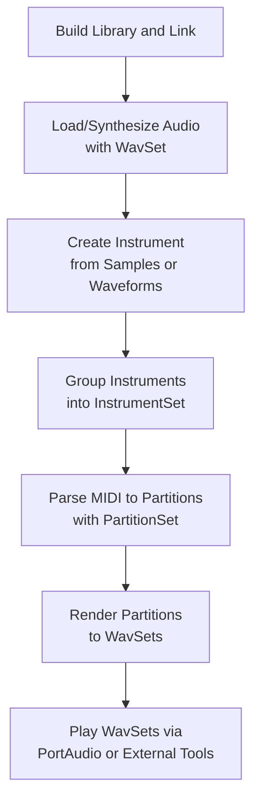

# Getting Started – Basic Usage Flow

This guide walks you through a typical end-user workflow for integrating the **spiWavSetLib** C++ audio library. You will:

1. **Build** and **link** the library into your application.
2. **Load** or **synthesize** audio snippets with `WavSet`.
3. **Create** an `Instrument` from waveforms or sample folders.
4. **Group** instruments into an `InstrumentSet`.
5. **Parse** a MIDI file into `Partitions` via `PartitionSet`.
6. **Render** partitions into `WavSet`s and **play** them.



---

## 1. Build and Link the Library

Link against the **spiWavSetLib** static or shared library, along with its dependencies:

- **libsndfile** for WAV I/O
- **PortAudio** for real-time playback
- Optional external players: **sox**, **spiplay**

Include the headers (e.g., `spiws_WavSet.h`, `spiws_instrument.h`, `spiws_partitionset.h`) and add the `spiwavsetlib.lib` to your linker inputs. Ensure the DLLs for PortAudio and libsndfile are discoverable at runtime.

---

## 2. Load or Synthesize Audio with WavSet 🎶

The `WavSet` class encapsulates a buffer of interleaved PCM floats, providing methods to load, generate and play audio .

| Method | Description |
| --- | --- |
| -------------------------------: | :----------------------------------------------- |
| `ReadWavFile(const char*)` | Load a `.wav` file into the buffer |
| `CreateSilence(float)` | Generate silence of given **duration** (sec) |
| `CreateSin(float,…,float)` | Synthesize a sine wave at specified **frequency** and **amplitude** |
| `CreateSquare`, `CreateSaw`, `CreateTri` | Generate other basic waveforms |
| `Play(PaStreamParameters*)` | Stream audio via PortAudio |


```cpp
#include "spiws_WavSet.h"

WavSet snippet;
snippet.ReadWavFile("drum_loop.wav");                   // Load from disk
WavSet tone;
tone.CreateSin(1.0f, 44100, 2, 440.0f, 0.5f);           // 1s A4 sine wave
snippet.Sum(0.8f, &tone, 2.0f, 1.0f);                   // Mix tone at 2s offset
snippet.Play(outputParams);                             // Play via PortAudio
```

---

## 3. Create an Instrument 🎹

An **Instrument** groups multiple `WavSet`s (samples or synthesized waveforms) and maps them to MIDI note numbers .

- **From Sample Folders**:

```cpp
  #include "spiws_instrument.h"

  Instrument piano;
  piano.CreateFromName("piano", 88);                   // Load ~88 piano samples
```

- **Synthetic Waveform Bank**:

```cpp
  Instrument synth;
  // Manually add sine, saw and square banks
  WavSet s;
  s.CreateSin(0.5f);
  synth.AddWavSet(&s);
```

**Key Methods**

- `CreateFromName(const char*, int)`
- `CreateFromWavFolder(const char*, int)`
- `GetWavSetFromMidiNoteNumber(MidiEventSet*)`

---

## 4. Group Instruments into InstrumentSet

An `InstrumentSet` holds multiple instruments for quick selection or randomization .

```cpp
#include "spiws_instrumentset.h"

InstrumentSet band;
band.Populate("instruments_list.txt", 4);             // Load 4 instruments
Instrument* bass   = band.GetInstrumentFromID(0);
Instrument* solo   = band.GetInstrumentRandomly();
```

**Useful Members**

- `GetInstrumentFromID(int)`
- `GetInstrumentRandomly()`
- `Play(PaStreamParameters*, float, int)`

---

## 5. Parse MIDI into Partitions with PartitionSet

`PartitionSet` converts a MIDI file (or its `.mid.txt` dump) into a set of `Partition` objects, each containing `MidiEventSet`s for note-on/off pairs .

```cpp
#include "spiws_partitionset.h"

PartitionSet ps;
ps.Populate("song.mid");                                // Parses and converts to text
```

- **PartitionSet** reads header, time signatures, tempo, and splits tracks into `Partition`s.
- Each `Partition` has a `midieventsetvector` of note events.
- Call `CreateWavSetForPartition(...)` to render audio.

---

## 6. Render and Play

Render each partition into a `WavSet` using a chosen instrument, then play:

```cpp
// Within PartitionSet context
for (Partition* part : ps.partitionvector) {
    WavSet* out = new WavSet();
    ps.CreateWavSetForPartition(part, bass, 30.0f);     // 30s max
    out = part->pWavSet;
    out->Play(outputParams);                            // Real-time or blocking
}
```

Or use the high-level **PartitionSet** play helper:

```cpp
ps.Play(outputParams, &band, 60.0f);                  // Play all partitions (~60s max)
```

Under the hood, the library may fork external players (`sox` or `spiplay`) for scheduled playback, enabling flexible audio routing on Windows.

---

🎉 You are now set to integrate **spiWavSetLib** into your C++ application and begin creating dynamic, MIDI-driven audio experiences!