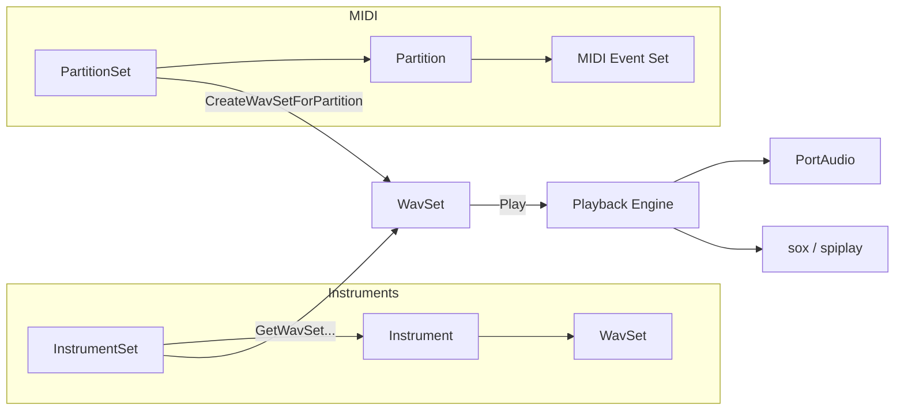

# Getting Started – Core Concepts Overview

This section introduces the **five core abstractions** at the heart of the SPIWavSetLib C++ audio engine. Each plays a distinct role in transforming MIDI-driven data into rich WAV-based audio streams on Windows, leveraging libsndfile, PortAudio, and external players like sox or spiplay.

| Abstraction | Purpose | Key Methods / Classes |
| --- | --- | --- |
| 🔊 **WavSet** | In-memory WAV buffer + helpers for file I/O, synthesis, edits, playback | `CreateSin`, `ReadWavFile`, `Mix`, `LoopSample`, `Play` |
| 🎹 **Instrument** | Collection of `WavSet`s mapped to MIDI notes 0–127 | `GetWavSetFromMidiNoteNumber`, `SetInstrumentName` |
| 🗂️ **InstrumentSet** | Container for many `Instrument`s; auto-loads from folders, orchestrates playback | `Populate`, `GetInstrumentRandomly`, `OpenAllStreams` |
| 📀 **Partition** | Single MIDI track: holds `MidiEventSet`s; renders into a `WavSet` | `CreateWavSetForPartition`, `GetLengthInMidiClockTicks` |
| 📂 **PartitionSet** | Group of `Partition`s; parses MIDI text, schedules audio creation & playback | `Play`, `ConvertMidiClockTicksToSeconds`, `GetTempoInBPM` |


---

## 🔊 WavSet

`WavSet` is the fundamental **audio buffer** abstraction. It encapsulates raw float samples plus metadata:

- **File I/O**
- `ReadWavFile`, `WriteWavFile`, `AppendWavFile`, `ReadWavFileHeader`
- **Basic synthesis**
- `CreateSilence`, `CreateSin`, `CreateSquare`, `CreateSaw`, `CreateTri`
- **Transforms & edits**
- `SplitInSegments`, `FadeSegmentEdges`, `Reverse`, `LoopSample`, `Concatenate`, `Mix`, `Sum`, `SpreadSample`
- **Playback**
- `Play` (blocking/blocking via PortAudio), `LaunchScheduledPlay` (sox/spiplay), `OpenStream`, `CloseStream`

| Member | Description |
| --- | --- |
| `float* pSamples` | Interleaved sample buffer |
| `int SampleRate` | Samples per second |
| `int numChannels` | Mono (1) or stereo (2) |
| `int totalFrames` | Number of sample frames |
| `std::string wavsetname` | Name or identifier |
| `int midinote` | MIDI note metadata (0–127) |
| `PaStream* pPaStream` | Active PortAudio stream pointer |


### Example: Load and Play a WAV File

```cpp
#include "spiws_WavSet.h"
#include "portaudio.h"

void PlayFile(const char* path) {
    WavSet wav;
    assert(wav.ReadWavFile(path));
    PaStreamParameters outParams{/* ... initialize ... */};
    wav.Play(&outParams);
}
```

---

## 🎹 Instrument

An `Instrument` is a **playable collection** of `WavSet` instances—one or more samples per MIDI note, or synthetic waveforms:

- **Container**
- `std::vector<WavSet*> wavsetvector`
- **Naming & patterns**
- `SetInstrumentName`, `GetInstrumentNameWithoutPath`,
- `SetWavSetPatternCodes` for pattern-based mapping
- **MIDI mapping**
- `GetWavSetFromMidiNoteNumber(int)`, `GetWavSetFromMidiNoteNumber(MidiEventSet*)`,
- `GetWavSetFromPatternCode(const char*)`
- **Random access**
- `GetWavSetRandomly()` picks a random sample

### Example: Create an Instrument from Folder

```cpp
#include "spiws_instrument.h"

Instrument* LoadPiano(const std::string& folder) {
    Instrument* inst = new Instrument();
    inst->SetInstrumentName(folder + "/*.wav");
    // Optionally sort or assign pattern codes:
    inst->SetWavSetPatternCodes(INSTRUMENT_PATTERNCODETOALL);
    return inst;
}
```

---

## 🗂️ InstrumentSet

`InstrumentSet` groups multiple `Instrument` objects and provides **utilities for bulk loading** and playback:

- **Population**
- `Populate(const char* wavfilesfolder, int iflag_subfolders=1)`
- `Populate(std::vector<string>*)`
- **Selection**
- `GetInstrumentRandomly()`, `GetInstrumentFromID(int)`,
- `GetInstrumentFromMidiTrackName(Partition*)`
- **Playback orchestration**
- `Play(PaStreamParameters*, float playbackSeconds, int maxConcurrent, int concatFlag)`
- `OpenAllStreams`, `CloseAllStreams`

### Example: Load All Instruments in a Directory

```cpp
#include "spiws_instrumentset.h"

InstrumentSet instSet;
instSet.Populate("C:/Samples/Instruments", /*subfolders=*/1);
```

---

## 📀 Partition & 📂 PartitionSet

### Partition

A `Partition` represents a **single MIDI track**:

- **Data**
- `std::string miditrackname`, `partitionname`
- `std::vector<MidiEventSet*> midieventsetvector`
- **Length & rendering**
- `GetLengthInMidiClockTicks()` → raw MIDI ticks
- `CreateWavSet(class Instrument*)` builds `pWavSet` by summing notes
- **Playback**
- `Play(PaStreamParameters*)`, `LaunchScheduledPlay(int usingFlag)`

### PartitionSet

`PartitionSet` is a **collection of Partitions**, parsed from a MIDI text export (`.mid.txt`):

1. **Parse MIDI text**
2. `IsNoteOn`, `IsNoteOff`, `CreateMidiEventNoteOn/Off`, `StoreNoteOn`, `RetreiveNoteOn`
3. **Timing**
4. `ConvertMidiClockTicksToSeconds`, `GetTempoInBPM`, `GetLengthInSeconds`
5. **Orchestration**
6. `CreateWavSetForPartition(Partition*, Instrument*, float maxSeconds)`
7. `Play(PaStreamParameters*, InstrumentSet*, float maxSeconds)`

---

## How They Work Together

Below is a high-level flowchart of the data flow from **WAV samples** and **MIDI events** into **audio playback**.



1. **Load**: `InstrumentSet` scans filesystem and builds `Instrument`s, each holding many `WavSet` samples.
2. **Parse**: `PartitionSet` reads MIDI text and splits tracks into `Partition`s and `MidiEventSet`s.
3. **Render**: For each `Partition`, `CreateWavSetForPartition` uses an `Instrument` to sum note samples into a new `WavSet`.
4. **Play**: The resulting `WavSet` is played through PortAudio or via external tools.

---

> **Tip:** Experiment by synthesizing simple waveforms with `WavSet::CreateSin`, then mix or loop them to understand how audio buffers compose. Use `PartitionSet` on a small MIDI file to see step-by-step rendering.