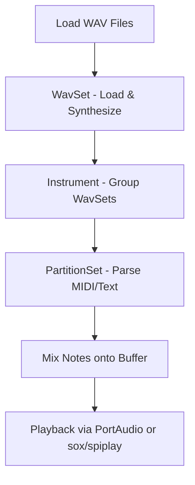

# Getting Started – What **spiwavsetlib** Does 🚀

**spiwavsetlib** is a native C++ library for creating, transforming, and playing collections of WAV audio buffers—called **WavSets**—and for building virtual instruments from them. It provides end-to-end support, from low-level WAV I/O to MIDI-driven playback, targeting Windows via:

- **libsndfile** for WAV file reading and writing
- **PortAudio** for real-time streaming
- External tools (e.g., **sox**, **spiplay**) for command-line playback

---

## 🎵 Core Components

| Component | Responsibility |
| --- | --- |
| **WavSet** | Load, create (silence, sine, square, saw, triangle), segment, mix, play audio |
| **Instrument** | Group multiple WavSets; map MIDI note numbers, frequencies, or pattern codes to WavSets |
| **InstrumentSet** | Manage collections of Instruments; populate from folders; open/close audio streams |
| **PartitionSet** | Parse Standard MIDI Files or text-based MIDI; schedule note events into time-aligned partitions |
| **Partition** | Represent one MIDI track; convert events into a composite WavSet for playback |


---

## 🔧 Dependencies

| Library / Tool | Purpose | Included via |
| --- | --- | --- |
| libsndfile | WAV file I/O (read/write headers/data) | `#include <sndfile.hh>` |
| PortAudio | Streaming audio to sound device | `#include "portaudio.h"` |
| sox | External command-line playback | Used by `WavSet::Play` when `USING_SOX` flag |
| spiplay | Custom playback utility | Used by `WavSet::Play` when `USING_SPIPLAY` |


---

## ⚙️ Basic Workflow

1. **Load or Synthesize Audio**
2. Create a new `WavSet`
3. Read an existing file or generate tones
4. **Segment & Transform**
5. Split into attack/sustain segments
6. Apply fades, reverse, loop, or resample
7. **Assemble Instruments**
8. Instantiate an `Instrument`
9. Populate with multiple `WavSet` instances
10. **Parse MIDI & Partition**
11. Load a MIDI file via `PartitionSet`
12. Break into per-track `Partition` objects
13. **Render & Play**
14. Mix notes onto a silent buffer
15. Stream via PortAudio or launch sox/spiplay processes

---

## 📦 Quick Start Example

```cpp
#include "spiws_wavset.h"
#include "spiws_instrument.h"
#include "spiws_partitionset.h"
#include "portaudio.h"

int main() {
    // 1. Initialize PortAudio
    Pa_Initialize();
    PaStreamParameters outParams = {/* ... setup output device ... */};

    // 2. Load a WavSet and play raw audio
    WavSet kick;
    kick.ReadWavFile("kick.wav");            // Load from disk
    kick.SplitInSegments(0.5);               // Split into 0.5 s segments
    kick.Play(&outParams);                   // Stream via PortAudio

    // 3. Build an Instrument from a folder of samples
    Instrument drumKit;
    drumKit.SetInstrumentName("wavfolders_drumkit.txt");
    drumKit.Play(&outParams, INSTRUMENT_WAVSETALLATONCE);

    // 4. Parse and play a MIDI file
    PartitionSet midiScore;
    midiScore.ParseMidiFile("score.mid");
    midiScore.Play(&outParams, /* instruments */ nullptr, /* flags */ 1);

    Pa_Terminate();
    return 0;
}
```

---

## 🔄 High-Level Flow



---

> **Tip:** Begin by experimenting with `WavSet` methods—such as `CreateSin()`, `SplitInSegments()`, and `Play()`—before composing full instruments and MIDI-driven playback.