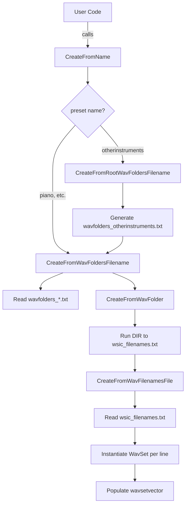

# Instrument: Building Playable Instruments

## Creating Sample-Based Instruments

This section covers helper methods in the `Instrument` class that load recorded WAV samples to build playable, sample-based instruments. Instead of writing C++ code to assemble sounds, end users can simply edit text files or folders containing WAV files.

---

## CreateFromWavFilenamesFile 📄

Reads a plaintext list of WAV file paths and builds a `WavSet` for each entry. If sidecar `.txt` files (from tools like spipitchdetection) exist, MIDI note numbers are auto-detected.

```cpp
bool Instrument::CreateFromWavFilenamesFile(
    const char* wavfilenamesfile,
    int maxnumberofwavset = INSTRUMENT_MAXNUMBEROFWAVSET
);
```

- **What it does**
- Opens `wavfilenamesfile` and reads each line as a WAV path
- For every valid WAV:
- Instantiates a new `WavSet`
- Calls `ReadWavFile(...)`, handling sample-rate resampling and stereo conversion
- Extracts MIDI note metadata if a matching `.txt` exists
- Populates `wavsetvector` with these `WavSet` objects
- **Why it matters**
- Lets users define instruments by listing sample files rather than coding each voice
- **Key steps**
- Load lines into `vector<string> wavfilenames`
- For each file: `new WavSet; ReadWavFile(); Resample if needed; wavsetvector.push_back()`
- Return success status

See implementation details in `spiws_instrumentset.cpp`   and declaration in `spiws_instrument.h`  .

| Parameter | Type | Description |
| --- | --- | --- |
| **wavfilenamesfile** | `char*` | Path to a text file listing one WAV path per line |
| **maxnumberofwavset** | `int` | Upper limit on how many `WavSet` instances to load per call |


---

## CreateFromWavFolder 📁

Scans a single folder for `.wav` files (including subfolders) and delegates to `CreateFromWavFilenamesFile`.

```cpp
bool Instrument::CreateFromWavFolder(
    const char* wavfolder,
    int maxnumberofwavset = INSTRUMENT_MAXNUMBEROFWAVSET
);
```

- **What it does**
- Executes an OS `DIR` command to list `wavfolder\*.wav` into `wsic_filenames.txt`
- Calls `CreateFromWavFilenamesFile("wsic_filenames.txt", ...)`
- **Use case**
- Quickly turn an entire sample library directory into an instrument
- **Note**
- Supports recursive listing with `/S` flag so nested folders are included

Refer to the implementation in `spiws_instrumentset.cpp`  .

---

## CreateFromWavFoldersFilename 📂

Picks a folder path at random from a descriptor file, then calls `CreateFromWavFolder`.

```cpp
bool Instrument::CreateFromWavFoldersFilename(
    const char* wavfoldersfilename,
    int maxnumberofwavset = INSTRUMENT_MAXNUMBEROFWAVSET
);
```

- **What it does**
- Reads `wavfoldersfilename` (e.g., `wavfolders_piano.txt`)
- Selects one entry randomly or by filter
- Invokes `CreateFromWavFolder(selectedPath, ...)`
- **Why it matters**
- Enables pools of sample sets; e.g., alternate piano recordings
- **Parameter file format**
- Plain text, one folder path per line, sorted or random order

See `spiws_instrumentset.cpp` for source lines  .

---

## CreateFromRootWavFoldersFilename 🔍

Recursively enumerates all subfolders of a root directory, then delegates to `CreateFromWavFoldersFilename`.

```cpp
bool Instrument::CreateFromRootWavFoldersFilename(
    const char* rootwavfoldersfilename,
    int maxnumberofwavset = INSTRUMENT_MAXNUMBEROFWAVSET
);
```

- **Workflow**
- Read a root folder from `rootwavfoldersfilename`
- Run `DIR root\*.* /S /B /O:N > wavfolders_otherinstruments.txt`
- Call `CreateFromWavFoldersFilename("wavfolders_otherinstruments.txt", ...)`
- **Best for**
- Large hierarchies of sample libraries (e.g., world instruments)

Based on implementation in `spiws_instrumentset.cpp`  .

---

## CreateFromName 🎸

Offers **convenient presets** by mapping instrument names to specific folder-list files.

```cpp
bool Instrument::CreateFromName(
    const char* name,
    int maxnumberofwavset = INSTRUMENT_MAXNUMBEROFWAVSET
);
```

- **Supported names**
- `"piano"`, `"guitar"`, `"bass"`, `"drumkit"`, `"horns"`, `"organ"`, `"violin"`, `"africa"`, `"otherinstruments"`
- **Mechanism**
- Internally calls `CreateFromWavFoldersFilename("wavfolders_<name>.txt", ...)`
- `"otherinstruments"` → triggers `CreateFromRootWavFoldersFilename` for broad coverage
- **Advantages**
- One-line instrument setup:

```cpp
    Instrument myInst;
    myInst.CreateFromName("piano");
```

Implementation resides in `spiws_instrumentset.cpp`  .

---

## Workflow Overview



---

## Best Practice Card

```card
{
    "title": "User-Editable Instruments",
    "content": "Define or swap sample-based instruments by editing text lists or folders, without modifying code."
}
```