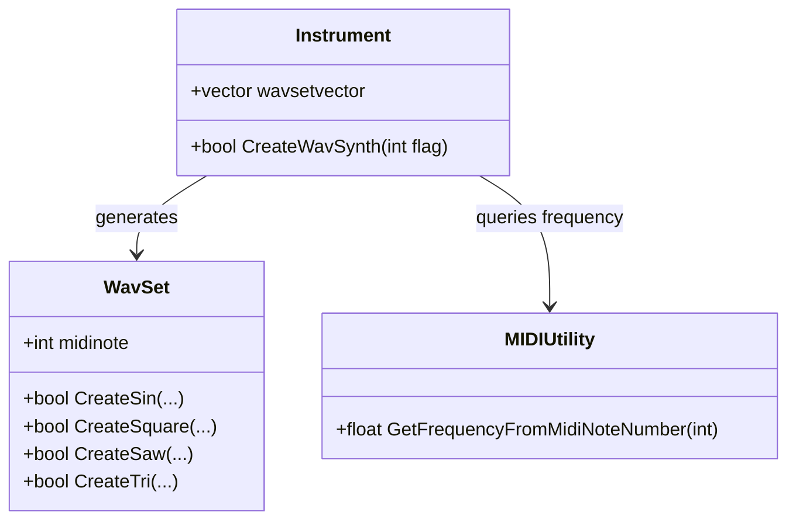

# Creating Synthetic Instruments

This section covers how the **Instrument** class generates a full 128-note synthetic instrument by synthesizing basic waveforms. The method `Instrument::CreateWavSynth(int flag)` automates buffer allocation, waveform creation, MIDI-note frequency mapping, and organizes the results into a ready-to-use instrument bank.

## Supported Waveform Flags 🎵

The `flag` parameter to `CreateWavSynth` selects one of four basic waveforms. Flags are defined in **Instrument**’s header:

| Flag Constant | Value | Waveform Type |
| --- | --- | --- |
| ------------------------------- | :-----: | ------------------ |
| **INSTRUMENT_SYNTH_SINWAV** | 0 | Sine wave |
| **INSTRUMENT_SYNTH_SQUAREWAV** | 1 | Square wave |
| **INSTRUMENT_SYNTH_SAWWAV** | 2 | Sawtooth wave |
| **INSTRUMENT_SYNTH_TRIWAV** | 3 | Triangle wave |


These constants appear in `spiws_instrument.h` .

## How CreateWavSynth Works

1. **Set Instrument Name**

The method calls `SetInstrumentName(...)` to tag the instrument with a descriptive name.

1. **Allocate 128 Buffers**

It loops over MIDI note numbers **0** through **127**.

1. **Generate Waveform**

For each `i`, it creates a new `WavSet`, then invokes one of:

- `WavSet::CreateSin(...)`
- `WavSet::CreateSquare(...)`
- `WavSet::CreateSaw(...)`
- `WavSet::CreateTri(...)`

1. **Map MIDI to Frequency**

Frequencies are retrieved via

```cpp
   GetFrequencyFromMidiNoteNumber(i)
```

from **MIDIUtility**, ensuring accurate pitch .

1. **Store Results**

Upon success, it sets

```cpp
   pWavSet->midinote = i;
   wavsetvector.push_back(pWavSet);
```

Otherwise, it logs an error and aborts.

## Core Implementation

```cpp
bool Instrument::CreateWavSynth(int flag) {
    // Choose waveform type
    if (flag == INSTRUMENT_SYNTH_SINWAV) {
        SetInstrumentName("INSTRUMENT_SYNTH_SINWAV");
    }
    // ... handle other flags similarly ...

    // For each MIDI note, generate and store a WavSet
    for (int i = 0; i < 128; ++i) {
        WavSet* pWavSet = new WavSet;
        bool result = false;

        switch (flag) {
            case INSTRUMENT_SYNTH_SINWAV:
                result = pWavSet->CreateSin(
                    INSTRUMENT_MAXWAVSETLENGTH, 44100, 2,
                    GetFrequencyFromMidiNoteNumber(i)
                );
                break;
            case INSTRUMENT_SYNTH_SQUAREWAV:
                result = pWavSet->CreateSquare(
                    INSTRUMENT_MAXWAVSETLENGTH, 44100, 2,
                    GetFrequencyFromMidiNoteNumber(i)
                );
                break;
            case INSTRUMENT_SYNTH_SAWWAV:
                result = pWavSet->CreateSaw(
                    INSTRUMENT_MAXWAVSETLENGTH, 44100, 2,
                    GetFrequencyFromMidiNoteNumber(i)
                );
                break;
            case INSTRUMENT_SYNTH_TRIWAV:
                result = pWavSet->CreateTri(
                    INSTRUMENT_MAXWAVSETLENGTH, 44100, 2,
                    GetFrequencyFromMidiNoteNumber(i)
                );
                break;
            default:
                assert(false);
        }

        if (result) {
            pWavSet->midinote = i;
            wavsetvector.push_back(pWavSet);
        } else {
            StatusAddText(L"error in Instrument::CreateWavSynth(), not enough memory?\n");
            return false;
        }
    }

    return true;
}
```

*Excerpted and adapted from implementation* .

## Architecture & Relationships

This process ties three main components:

- **Instrument**

Manages a collection of `WavSet` objects and orchestrates creation.

- **WavSet**

Encapsulates raw audio buffers and waveform generators (`CreateSin`, etc.).

- **MIDIUtility**

Provides frequency mapping via `GetFrequencyFromMidiNoteNumber`.



## Frequency Mapping

The helper

```cpp
float GetFrequencyFromMidiNoteNumber(int midinotenumber);
```

converts a MIDI note index (0–127) into its corresponding frequency in Hz, ensuring each synthesized buffer is pitched correctly .

## Resulting Instrument

After `CreateWavSynth` completes, **Instrument** contains a **self-contained synthetic instrument**:

- A **128-note bank** (`wavsetvector`), each `WavSet` pre-tuned.
- Ready for **MIDI rendering**, **pattern-based playback**, or **file export**.
- No external WAV files required.

Utilize this instrument for experimental synthesis, sequencing, or embedding in audio applications.