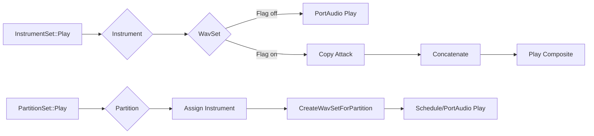

# Instrument: Building Playable Instruments – Instrument Playback and Rendering

This section explores how `Instrument`, `InstrumentSet`, and `PartitionSet` collaborate to audition samples, build composite textures, and render MIDI-driven audio. You’ll learn about direct sample playback, attack concatenation patterns, and high-level orchestration via PortAudio or external tools.

## Instrument Playback 🎹

An `Instrument` encapsulates a collection of `WavSet` samples. You can audition these samples or blend them into a single audio buffer.

- **Play modes**:
- **Sequence** (`INSTRUMENT_WAVSETINSEQUENCE`): Plays each `WavSet` in order.
- **All-at-once** (`INSTRUMENT_WAVSETALLATONCE`): Mixes all `WavSet`s into one buffer, then plays the result.
- **Method signature**:

```cpp
  void Instrument::Play(PaStreamParameters* pPaStreamOutputParameters,
                        int iflag = INSTRUMENT_WAVSETINSEQUENCE);
```

- **Behavior**:
- In sequence mode, loops over `wavsetvector` and calls `WavSet::Play`.
- In all-at-once mode, it:
- Creates a silent `WavSet` of maximum length.
- Sums each sample with appropriate amplitude.
- Plays the composite buffer once .

## Global Playback via InstrumentSet 🎵

An `InstrumentSet` manages multiple instruments, enabling batch audition or texture creation.

- **Play invocation**:

```cpp
  void InstrumentSet::Play(PaStreamParameters* pPaStreamParameters,
                           float numberofsecondsinplayback,
                           int numberofinstrumentsinplayback,
                           int iCONCATENATEATTACKSflag = 1);
```

- **Core loop**:
- Iterates each `Instrument*` in `instrumentvector`.
- For each instrument, iterates its `wavsetvector`.
- If `iCONCATENATEATTACKSflag == 0`, calls `WavSet::Play` directly.
- If `iCONCATENATEATTACKSflag == 1`, builds a composite of attack segments for later playback .
- **Typical parameters**:
- `numberofsecondsinplayback`: maximum playback duration.
- `numberofinstrumentsinplayback`: controls parallel play before pausing.

## Attack-Only Concatenation 🔪

When auditioning instrument timbres, isolating the attack portion can be insightful.

- **Process**:
- Allocate a temporary `WavSet* pWavSet3`.
- For each sample:
- Copy the first 0.2 s via

```cpp
       WavSet* pWavSet2 = new WavSet;
       pWavSet2->Copy(pWavSet, 0.2f, 0.0f);
       pWavSet3->Concatenate(pWavSet2);
       delete pWavSet2;
```

- Repeat until all attacks are concatenated.
- Play or export `pWavSet3` as a composite attack bank .

## MIDI-Based Orchestration 🎛️

For full MIDI workflows, `PartitionSet` applies instruments to note events and mixes a track-long `WavSet`.

1. **Create per-partition buffer**

```cpp
   bool PartitionSet::CreateWavSetForPartition(Partition* pPartition,
                                               Instrument* pInstrument,
                                               float numberofsecondsinplayback);
```

- Creates silence of proper length.
- Iterates `midieventsetvector`, selects `WavSet*` via

`pInstrument->GetWavSetFromMidiNoteNumber(...)`.

- Offsets and sums each note into the silence buffer .

1. **Play partitions with instruments**

```cpp
   void PartitionSet::Play(PaStreamParameters* pPaStreamParameters,
                           InstrumentSet* pInstrumentSet,
                           float numberofsecondsinplayback);
```

- Randomly assigns instruments per partition.
- Calls `CreateWavSetForPartition` then schedules playback either via PortAudio or external tools like sox/spiplay .

## Playback Methods & Tools ⚙️

| Method | Description |
| --- | --- |
| **PortAudio** (`Play`) | Real-time, low-latency playback via API |
| **Sox / Spiplay** (`LaunchScheduledPlay`) | External players invoked via `system` calls |


### Comparison

- PortAudio delivers direct streaming within the app.
- Sox/Spiplay spawns separate processes for background rendering or GUI-less export.

## High-Level Workflow



This diagram outlines the decision paths for both sample-based audition and MIDI-driven rendering.

---

> **Note**: In end-user scenarios, you rarely call individual `Instrument::Play` methods directly. Instead, construct instruments, pack them into an `InstrumentSet` or pass to `PartitionSet` for seamless orchestration.