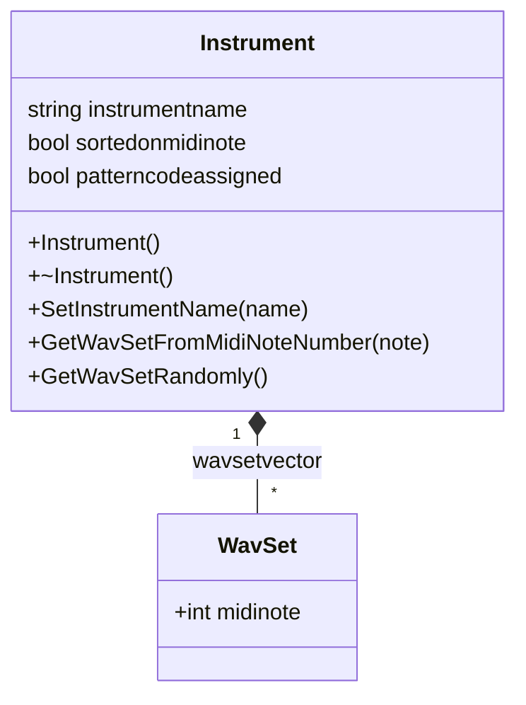

# Instrument: Building Playable Instruments – Instrument Structure

This section describes the **Instrument** class, which encapsulates a collection of playable **WavSet** objects. An `Instrument` holds a human-readable name and provides utility methods to retrieve samples by MIDI note, pattern code, or at random. Mapping each `WavSet` via its `midinote` field enables responsive MIDI playback and seamless rendering of MIDI partitions.

---

## Class Definition

The **Instrument** class is declared in `spiws_instrument.h`. It exposes a public vector of pointers to `WavSet`, plus metadata and search utilities.

```cpp
class SPIWAVSETLIB_API Instrument {
public:
    std::vector<class WavSet*> wavsetvector;
    std::string instrumentname;
    bool sortedonmidinote;
    bool patterncodeassigned;

    Instrument();
    ~Instrument();

    bool SetInstrumentName(std::string filenamepattern);
    const char* GetInstrumentName();
    const char* GetInstrumentNameWithoutPath();

    // Pattern code assignment
    void SetWavSetPatternCodes(int flag);
    const char* GetWavSetPatternCodes();
    const char* GetWavSetPatternNotes();

    // WavSet enumeration
    int GetNumberOfWavSet();
    class WavSet* GetWavSetFromID(int idwavset);
    class WavSet* GetWavSetRandomly();

    // Frequency / MIDI lookup
    class WavSet* GetWavSetFromFrequency(float frequency_hz);
    class WavSet* GetWavSetFromMidiNoteNumber(int midinotenumber);
    class WavSet* GetWavSetFromMidiNoteName(const char* midinotename);

    // Pattern-based lookup
    class WavSet* GetWavSetFromPatternCode(const char* patterncode);
    class WavSet* GetWavSetFromPatternCode(const char* patterncode, int patternrange);

    // Instrument builders
    bool CreateFromName(const char* name, int maxnumberofwavset);
    bool CreateFromRootWavFoldersFilename(const char* rootwavfoldersfilename, int maxnumberofwavset);

    // Playback
    void Play(PaStreamParameters* pPaStreamOutputParameters, int flag);
    bool CloseAllStreams();
};
```

---

## Data Members

Below is a summary of the key **data members** that define an instrument’s structure:

| Member | Type | Description |
| --- | --- | --- |
| **wavsetvector** | `std::vector<WavSet*>` | Collection of pointers to each sample/note (`WavSet`) |
| **instrumentname** | `std::string` | Human-readable name or file-pattern used to build the instrument |
| **sortedonmidinote** | `bool` | Flag indicating whether `wavsetvector` is sorted by `midinote` |
| **patterncodeassigned** | `bool` | Flag indicating whether pattern codes have been assigned |


---

## Core Responsibilities

An **Instrument** is responsible for:

- Managing a flexible collection of **WavSet** samples.
- Providing lookup methods by **MIDI note**, **frequency**, or **pattern code**.
- Supplying random selection for generative or stochastic playback.
- Encapsulating naming and pattern assignment logic for batch loading.

---

## Key Methods 🎵

### Initialization & Cleanup

- **Instrument()**: Constructs an empty instrument.
- **~Instrument()**: Releases any open streams and cleans up.

### Instrument Identification

- **SetInstrumentName(std::string)**: Configures the human-readable name or filename pattern.
- **GetInstrumentName()** / **GetInstrumentNameWithoutPath()**: Retrieve the full name or stripped version.

### WavSet Management

- **GetNumberOfWavSet()**: Returns the total samples loaded.
- **GetWavSetFromID(int)**: Retrieves the sample by its index.
- **GetWavSetRandomly()**: Returns a random `WavSet*` for varied playback.

### MIDI & Frequency Lookup

- **GetWavSetFromFrequency(float)**: Finds the closest sample by frequency.
- **GetWavSetFromMidiNoteNumber(int)** / **GetWavSetFromMidiNoteName(const char*)**: Direct lookup by MIDI note.

### Pattern-Based Search

- **SetWavSetPatternCodes(int)**: Defines how pattern codes map to samples (e.g., `ALLATONCE`, `RANDOM`).
- **GetWavSetFromPatternCode(const char*)**: Retrieves a sample matching a single-character code.
- **GetWavSetFromPatternCode(const char*, int)**: Handles codes within a specified range.

---

## Class Diagram

This diagram shows the composition relationship between **Instrument** and **WavSet**, highlighting the `wavsetvector` container.



---

## Usage Example

Below is a minimal example demonstrating how to build an instrument from a folder of WAV files and retrieve a note by MIDI number:

```cpp
#include "spiws_instrument.h"
#include "portaudio.h"

// 1. Create and load an instrument from predefined folder list
Instrument piano;
if (!piano.CreateFromName("piano", /* max samples */ 128)) {
    std::cerr << "Failed to load piano instrument\n";
    return -1;
}

// 2. Retrieve sample for middle C (MIDI note 60)
WavSet* middleC = piano.GetWavSetFromMidiNoteNumber(60);
if (middleC) {
    std::cout << "Playing note: " << middleC->GetName() << "\n";
    // Play via PortAudio stream parameters...
    // middleC->Play(paOutputParams, lengthInSeconds);
}

// 3. Clean up streams when done
piano.CloseAllStreams();
```

---

## Integration with Other Components

- **Partition**: Uses `Instrument::GetWavSetFromMidiNoteNumber` to render MIDI tracks into audio (`Partition::CreateWavSet`).
- **InstrumentSet**: Manages multiple `Instrument` instances, selecting one randomly or by track name for multi-instrument playback.
- **WavSet**: Individual audio buffers representing a single note or sample; exposes playback, segmentation, and DSP operations.

---

**Instrument** provides the foundational structure for playable collections of WAV samples. By mapping each `WavSet` to a MIDI note and offering rich lookup methods, it enables dynamic, sample-based synthesis and rendering of MIDI data on Windows platforms.