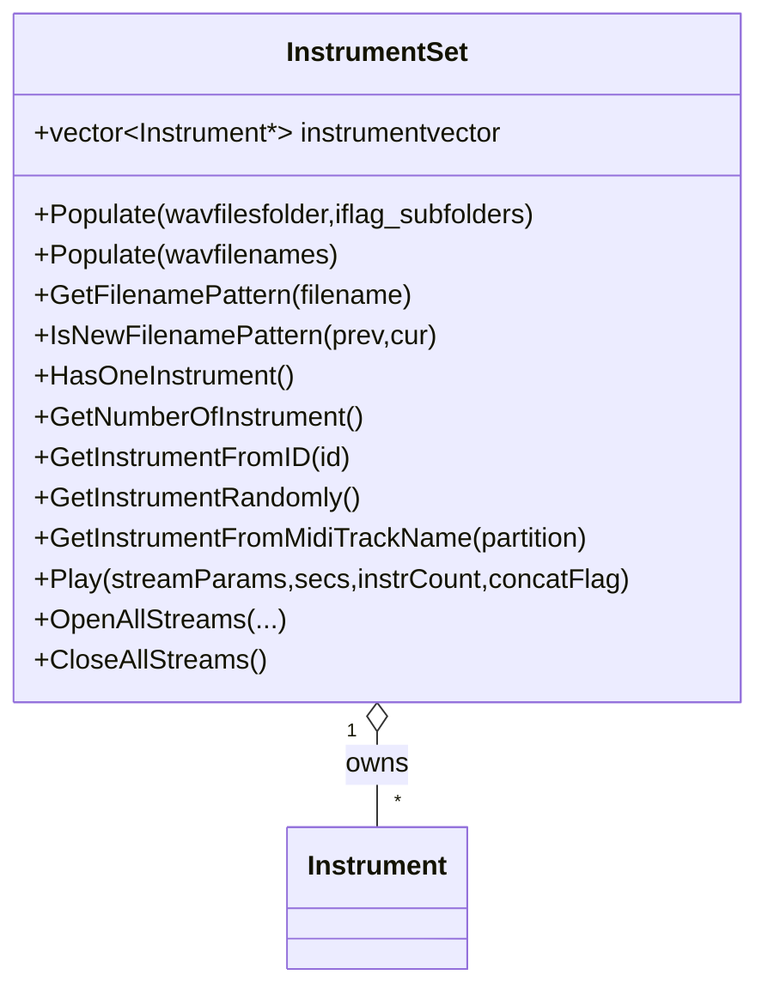

# InstrumentSet Overview

InstrumentSet serves as a **container for multiple Instrument** objects. It manages a `vector<Instrument*>` and provides methods to build, query, retrieve, and play instruments in unison. You use it to batch-load WAV samples, map MIDI tracks, and orchestrate multi‐instrument playback on Windows .



## Core Data Structure

InstrumentSet stores pointers to Instrument instances in a single member:

- **instrumentvector**: `std::vector<Instrument*>` of all loaded instruments .

## Populating Instruments 🎷

InstrumentSet groups WAV files into instruments by filename patterns.

- ### Populate from Folder

Loads all WAV files under a folder (and subfolders if flagged), then groups them by shared name prefix.

```cpp
  void Populate(const char* wavfilesfolder, int iflag_subfolders=1);
```

**Example:**

```cpp
  InstrumentSet set;
  set.Populate("C:\\Samples", 1);
```

This runs `DIR ... > wsip_filenames.txt`, reads the list, and calls the vector overload to build instruments .

- ### Populate from Filename List

Directly accepts a list of file paths. It:

1. Reads each WAV into a new WavSet.
2. Uses **GetFilenamePattern** to extract the grouping key.
3. Creates a new Instrument when the pattern changes; otherwise appends to the last instrument.

```cpp
  void Populate(std::vector<std::string>* pwavfilenames);
```

Internally, it uses:

```cpp
  std::string GetFilenamePattern(const char* filename);
  bool        IsNewFilenamePattern(const char* prev, const char* cur);
```

## Querying Instruments 🎹

InstrumentSet lets you inspect and select loaded instruments easily.

- **HasOneInstrument**

Returns `true` if at least one instrument exists.

```cpp
  bool HasOneInstrument();
```

- **GetNumberOfInstrument**

Retrieves the total count.

```cpp
  int GetNumberOfInstrument();
```

- **GetInstrumentFromID**

Fetches by zero-based index.

```cpp
  Instrument* GetInstrumentFromID(int id);
```

- **GetInstrumentRandomly**

Chooses one instrument at random.

```cpp
  Instrument* GetInstrumentRandomly();
```

- **GetInstrumentFromMidiTrackName**

Maps a MIDI track (via Partition) to an instrument. Current implementation picks the last instrument by default.

```cpp
  Instrument* GetInstrumentFromMidiTrackName(class Partition* pPartition);
```

## Playback Orchestration 🎶

InstrumentSet can play all instruments in a coordinated fashion via PortAudio, sox, or spiplay.

```cpp
void Play(
  PaStreamParameters* pPaStreamParameters,
  float numberofsecondsinplayback,
  int   numberofinstrumentsinplayback,
  int   iCONCATENATEATTACKSflag = 1
);
```

- **numberofsecondsinplayback**: max playback duration per group.
- **numberofinstrumentsinplayback**: instruments to play in parallel before waiting.
- **iCONCATENATEATTACKSflag**:
- 0 = play each WavSet directly
- 1 = extract attack segments (first 0.2 s), concatenate per instrument, then play grouped .

The method loops each instrument’s `wavsetvector`, builds a combined `WavSet*`, and either streams it live or spawns an external player, inserting `Sleep(...)` calls to control concurrency.

## Stream Management

You can open and close all PortAudio streams for every instrument in one call.

| Method | Description | Signature Reference |
| --- | --- | --- |
| OpenAllStreams | Opens input/output streams with common callback | filecite turn2file4 |
| CloseAllStreams | Closes all streams for each instrument | filecite turn2file2 |


```cpp
bool OpenAllStreams(
  PaStreamParameters* inParams,
  PaStreamParameters* outParams,
  PaStreamCallback*   callback
);

bool CloseAllStreams();
```

## Method Summary

| Method | Purpose |
| --- | --- |
| Populate(folder, subfolders) | Discover and group WAV files by pattern |
| Populate(filename list) | Build instruments from explicit file list |
| GetFilenamePattern | Extract base name before last underscore/space |
| IsNewFilenamePattern | Compare patterns to detect new instrument boundary |
| HasOneInstrument | Check if at least one instrument is loaded |
| GetNumberOfInstrument | Return total instruments |
| GetInstrumentFromID | Access instrument by index |
| GetInstrumentRandomly | Pick a random instrument |
| GetInstrumentFromMidiTrackName | Map MIDI track name to instrument |
| Play | Orchestrate playback across all instruments |
| OpenAllStreams / CloseAllStreams | Batch manage PortAudio streams |


```card
{
    "title": "Tip",
    "content": "Naming conventions in WAV filenames determine instrument grouping. Use consistent prefixes."
}
```