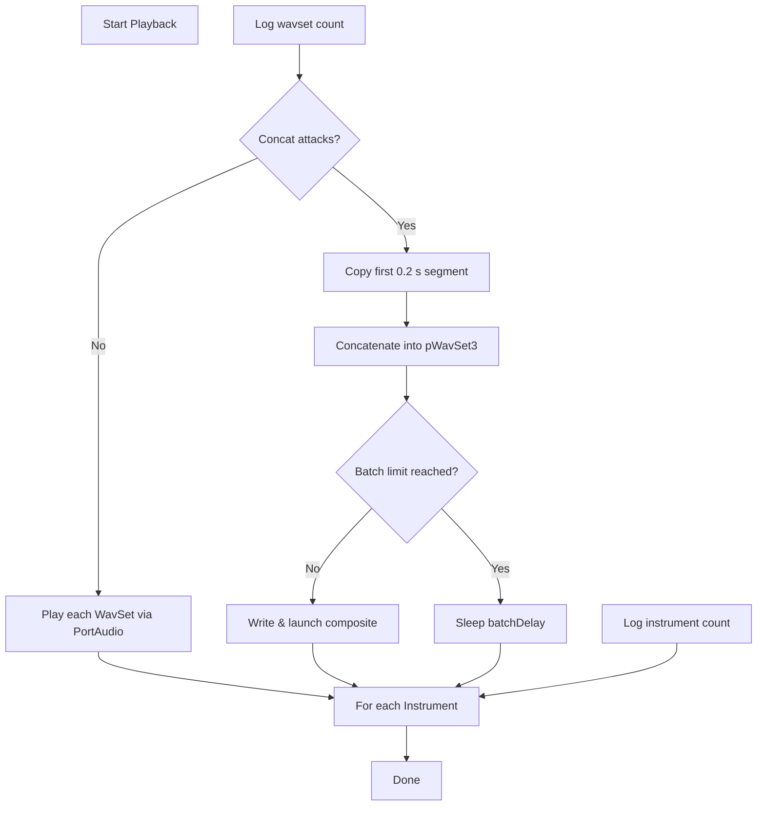

# InstrumentSet: Managing Multiple Instruments – Playback Coordination

InstrumentSet encapsulates a collection of `Instrument` objects, each containing multiple `WavSet` audio buffers. The `Play` method coordinates playback or attack‐segment concatenation across all instruments, leveraging PortAudio for direct playback or external tools (sox, spiplay) for file‐based playback.

## Signature & Parameters

```cpp
void InstrumentSet::Play(
  PaStreamParameters* pPaStreamParameters,
  float numberofsecondsinplayback,
  int numberofinstrumentsinplayback,
  int iCONCATENATEATTACKSflag = 1
);
```

| Parameter | Type | Description |
| --- | --- | --- |
| **pPaStreamParameters** | `PaStreamParameters*` | PortAudio output parameters for real‐time playback. |
| **numberofsecondsinplayback** | `float` | Maximum playback time (in seconds) before batching delays. |
| **numberofinstrumentsinplayback** | `int` | Number of instruments to play simultaneously before inserting a delay. |
| **iCONCATENATEATTACKSflag** | `int` (0 or 1) |  |


- `0`: Play each `WavSet` immediately via PortAudio
- `1`: Extract and concatenate attack segments only (first 0.2 s) into a composite buffer  |

## Playback Workflow 🎶

1. **Log total instruments**
2. Uses `StatusAddText` to print instrument count.
3. **Iterate instruments**
4. For each `Instrument* pInstrument` in `instrumentvector`:
5. Log its **WavSet** count.
6. Allocate a temporary `WavSet* pWavSet3` (for concatenation).
7. **Iterate WavSets**
8. If **no concatenation** (`iCONCATENATEATTACKSflag == 0`):
9. Call `pWavSet->Play(pPaStreamParameters)`.
10. If **concatenation** enabled:
11. Copy the first 0.2 s of each `pWavSet` into `pWavSet2`.
12. Concatenate `pWavSet2` into `pWavSet3`.
13. **Batching & Delay ⏱️**
14. After processing each instrument, if concatenation is on:
15. For every `numberofinstrumentsinplayback` instruments played, call

```cpp
       Sleep((int)numberofsecondsinplayback * 1000);
```

to avoid overlapping playback .

1. **Composite Playback (optional)**
2. In debug or alternate builds, `pWavSet3` can be:
3. Played directly via PortAudio (`WavSet::Play`).
4. Written to disk as `"instrumentN.wav"` and launched with sox or spiplay.

## Flowchart: InstrumentSet::Play Process



## Integration with MIDI Workflows

In MIDI rendering, `InstrumentSet` is provided to **PartitionSet::Play**, which:

- Logs instrument count.
- Iterates **partitions** (MIDI tracks), selecting an instrument (e.g., randomly via `GetInstrumentRandomly()`).
- Calls `CreateWavSetForPartition` to build a timed `WavSet`.
- Launches playback per partition with sox or spiplay.

This design cleanly separates **instrument audio management** from **MIDI‐to‐audio mapping**, enabling flexible live playback or file‐based rendering.

## Key Responsibilities & Design Notes

- **Logging**: Uses `StatusAddText` and debug prints to trace counts at each stage.
- **Flexibility**:
- **Real‐time** via PortAudio (direct `WavSet::Play`).
- **File‐based** via external players (sox/spiplay).
- **Attack Segmentation**: The `iCONCATENATEATTACKSflag` allows focusing on per‐note attacks for layering or preview.
- **Batch Control**: The simple `Sleep` mechanism throttles concurrency without complex threading.

## Best Practices & Recommendations 📌

```card
{
    "title": "Batch Size Tuning",
    "content": "Adjust numberofinstrumentsinplayback to balance performance and latency."
}
```

> **Note:** The current code comments out direct PortAudio playback of concatenated buffers; enabling these paths can simplify debugging or integrate composite playback without file I/O.

- Use **small batch sizes** to reduce initial delay but avoid audio clipping.
- When concatenating attacks, **verify memory cleanup** for `pWavSet2` and `pWavSet3`.
- For production, consider replacing `Sleep` with an **event‐driven** or **callback** mechanism to detect playback completion.