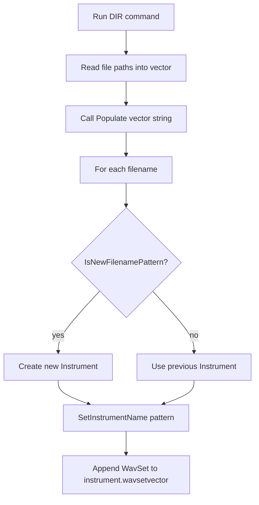

# InstrumentSet: Managing Multiple Instruments

InstrumentSet gathers and organizes multiple instruments, each composed of one or more WAV samples (WavSets). It enables automatic palette creation from sample libraries and flexible manual configuration.

## Populating Instruments

InstrumentSet supports two primary ways to populate its `instrumentvector`:

1. **Auto-scan** of WAV files by folder or descriptor files
2. **Manual creation** via standard instrument categories

---

### 1. Auto-scan from WAV Files 📂

Scan a folder (optionally recursive) to collect `.wav` files, group them by filename patterns, and build Instruments.

#### API

```cpp
// Scan a filesystem folder for .wav files and populate InstrumentSet
void Populate(const char* wavfilesfolder, int iflag_subfolders = 1);  
```

```cpp
// Populate using an existing list of full file paths
void Populate(std::vector<std::string>* wavfilenames);
```

Both overloads live in **spiws_instrumentset.h**   and the implementation in **spiws_instrumentset.cpp** .

#### Workflow



#### Filename Pattern Extraction

Group samples by prefix before the last underscore or space:

```cpp
std::string GetFilenamePattern(const char* filename);
```

- **Remove path & extension**
- **Find last** `_` **or** ` `
- **Return** substring **before** that position

```cpp
string fn(filename);
// strip path
size_t pos = fn.rfind('\\');
if (pos != string::npos) fn = fn.substr(pos + 1);
// strip extension
pos = fn.rfind('.');
if (pos != string::npos) fn = fn.substr(0, pos);
// extract prefix
pos = fn.rfind('_');
if (pos != string::npos) return fn.substr(0, pos);
pos = fn.rfind(' ');
if (pos != string::npos) return fn.substr(0, pos);
return fn;
```

(See implementation in **spiws_instrumentset.cpp** )

#### New Pattern Detection

Decide when a filename belongs to a new Instrument:

```cpp
bool IsNewFilenamePattern(const char* prevfilename,
                          const char* newfilename);
```

- **Compute** patterns for both filenames
- **Compare**; if different → **new** Instrument

```cpp
return GetFilenamePattern(prevfilename)
       .compare(GetFilenamePattern(newfilename)) != 0;
```

(See **spiws_instrumentset.cpp** )

---

### 2. Manual Population via Instrument Creation 🎹

Beyond auto-scanning, you can programmatically construct Instruments from named categories:

```cpp
bool Instrument::CreateFromName(const char* name,
                                int maxnumberofwavset);
```

Common category names map to descriptor files listing sample folders :

| **Name** | **Descriptor File** |
| --- | --- |
| piano | wavfolders_piano.txt |
| guitar | wavfolders_guitar.txt |
| bass | wavfolders_bass.txt |
| drumkit | wavfolders_drumkit.txt |
| horns | wavfolders_horns.txt |
| organ | wavfolders_organ.txt |
| violin | wavfolders_violin.txt |
| africa | wavfolders_otherinstruments_world_africa.txt |
| otherinstruments | wavfolders_otherinstrumentsrootfolders.txt |


*Usage Example*:

```cpp
InstrumentSet set;

// Auto-scan a samples folder (recursive)
set.Populate("C:\\Samples\\Piano", /* subfolders */1);

// Manually add a drumkit instrument
Instrument* drums = new Instrument();
if (drums->CreateFromName("drumkit")) {
    set.instrumentvector.push_back(drums);
}

// Now set contains both auto-discovered and manually added instruments
```

---

```card
{
    "title": "Tip",
    "content": "Ensure your WAV files are named consistently so pattern grouping works correctly."
}
```

This section ensures you can flexibly build a multi-instrument palette—either by directory scanning with intelligent grouping or by explicit instrument category creation—laying the groundwork for mapping MIDI events to audio playback.