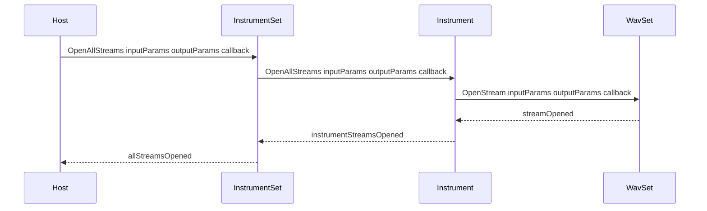

# InstrumentSet: Managing Multiple Instruments – Stream Management

The **InstrumentSet** class orchestrates PortAudio streams across multiple instruments. It provides utilities to open and close audio streams for each underlying **WavSet**, enabling real-time playback or custom audio engines. End users rarely invoke these methods directly; high-level **Play** routines manage stream lifecycles in simple scenarios.

## ⚙️ Overview

InstrumentSet’s stream management features:

- **OpenAllStreams**: Opens PortAudio streams for every instrument’s WAV buffers.
- **CloseAllStreams**: Closes active streams when playback ends.
- Wraps each **WavSet**’s `OpenStream`/`CloseStream` calls via Instrument-level helpers .

This ensures all loaded instruments are ready for audio I/O with consistent parameters.

## Opening Streams

Use `OpenAllStreams` to initialize PortAudio streams for every instrument:

```cpp
bool InstrumentSet::OpenAllStreams(
    PaStreamParameters* inputParams,
    PaStreamParameters* outputParams,
    PaStreamCallback*  callback
);
```

- **inputParams**: Configuration for audio input (can be `nullptr`).
- **outputParams**: Configuration for audio output.
- **callback**: User-supplied processing callback.

Internally, InstrumentSet iterates over its `instrumentvector` and invokes each Instrument’s `OpenAllStreams`, which in turn calls `WavSet::OpenStream` for all its WAV buffers .

### Stream Initialization Sequence



This flow guarantees each WAV buffer is registered with PortAudio before playback.

## Closing Streams

Once playback concludes, call `CloseAllStreams`:

```cpp
bool InstrumentSet::CloseAllStreams();
```

- Iterates all instruments
- Invokes `Instrument::CloseAllStreams`, which wraps `WavSet::CloseStream` calls
- Frees PortAudio resources

This prevents resource leaks and ensures a clean shutdown of audio devices.

## API Reference

| Method | Signature | Description |
| --- | --- | --- |
| **OpenAllStreams** | `bool OpenAllStreams(PaStreamParameters*, PaStreamParameters*, PaStreamCallback*)` | Opens streams for every **Instrument**’s WAV buffers. |
| **CloseAllStreams** | `bool CloseAllStreams()` | Closes all active streams across instruments. |


## Typical Usage

For custom real-time engines, the minimal stream lifecycle is:

1. **Open Streams**

```cpp
   instrumentSet.OpenAllStreams(inParams, outParams, paCallback);
```

1. **Start Playback** via your audio loop or PortAudio API.
2. **Close Streams**

```cpp
   instrumentSet.CloseAllStreams();
```

Higher-level `InstrumentSet::Play` methods handle these steps automatically for batch/demo scenarios.

## Internal Implementation

```cpp
bool InstrumentSet::OpenAllStreams(
    PaStreamParameters* in, 
    PaStreamParameters* out, 
    PaStreamCallback* cb
) {
    for (auto instr : instrumentvector) {
        instr->OpenAllStreams(in, out, cb);
    }
    return true;
}

bool InstrumentSet::CloseAllStreams() {
    for (auto instr : instrumentvector) {
        instr->CloseAllStreams();
    }
    return true;
}
```

- **Instrument::OpenAllStreams** iterates its `wavsetvector`, calling **WavSet::OpenStream**.
- **WavSet::OpenStream** wraps `Pa_OpenStream` to bind sample buffers to PortAudio .
- **CloseAllStreams** reverses this via **WavSet::CloseStream**.

## Best Practices

- **High-Level Use**: Invoke `Play` on InstrumentSet or PartitionSet for simple playback; it auto-manages streams.
- **Advanced Use**: When integrating into custom audio engines, call OpenAllStreams/CloseAllStreams to control stream lifecycles manually.
- **Thread Safety**: Ensure PortAudio is initialized (`Pa_Initialize`) before opening streams and terminated (`Pa_Terminate`) after closing them.
- **Error Handling**: Check boolean returns; on failure, PortAudio errors can be retrieved via `Pa_GetErrorText`.

---

By leveraging these stream management utilities, **InstrumentSet** simplifies multi-instrument audio playback, ensuring robust setup and teardown of PortAudio streams across complex instrument collections.