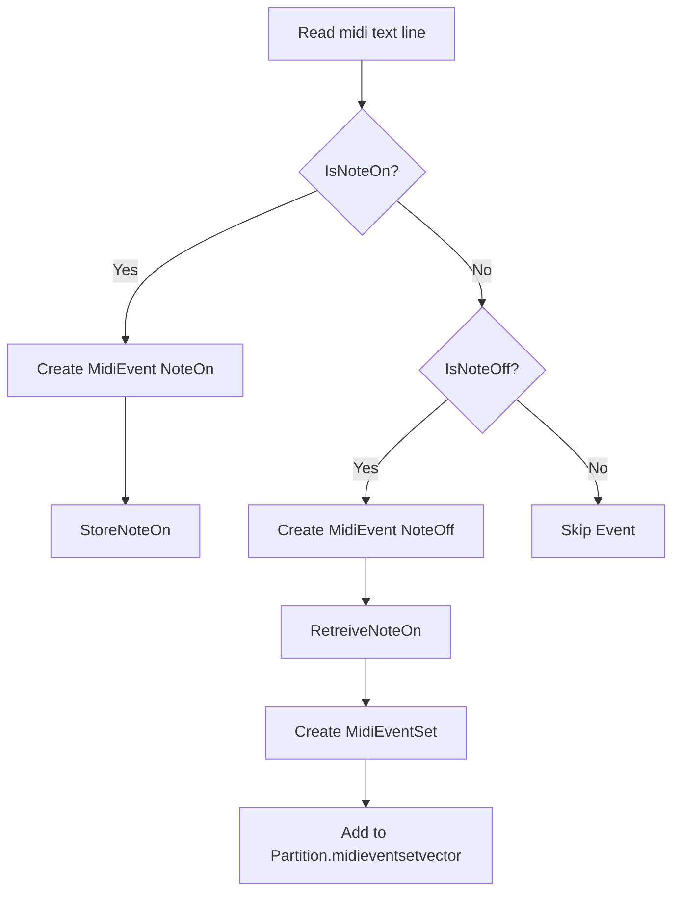

## MIDI Event Handling and Utilities

This section details how **MidiEvent** and **MidiEventSet** work together to parse, represent, and pair MIDI note events. These utilities form the foundation for mapping discrete MIDI messages into continuous audio segments.

---

## MidiEvent 🎹

Represents a single MIDI message, such as a note‐on or note‐off, parsed from a `.mid.txt` line.

| Field | Type | Description |
| --- | --- | --- |
| fTimeStamp | float | Timestamp in MIDI clock ticks |
| iMessageType | int | Message type (`MIDIEVENT_NOTEOFF=0`, `MIDIEVENT_NOTEON=1`) |
| iChannel | int | MIDI channel number (0–15) |
| iValue1 | int | Note number (`n=`) |
| iValue2 | int | Velocity (`v=`) |


**Key Methods**

| Method | Description |
| --- | --- |
| `CreateNoteOn(string midifileline)` | Parses a “On ch=…” line into a Note On event |
| `CreateNoteOff(string midifileline)` | Parses an “Off ch=…” or zero‐velocity On into Note Off |
| `IsNoteOn()` | Returns `true` if this is a Note On event |
| `IsNoteOff()` | Returns `true` if this is a Note Off event |
| `GetTimeStampInMidiClockTicks()` | Retrieves the event’s timestamp |


```cpp
class MidiEvent {
public:
    float fTimeStamp;
    int iMessageType;
    int iChannel;
    int iValue1;
    int iValue2;

    MidiEvent();
    ~MidiEvent();

    bool CreateNoteOn(std::string midifileline);
    bool CreateNoteOff(std::string midifileline);
    bool IsNoteOn();
    bool IsNoteOff();
    float GetTimeStampInMidiClockTicks();
};
```

---

## MidiEventSet 🎶

Groups a **Note On** and its corresponding **Note Off** into a single unit. This lets the system treat each played note as a start–end pair.

| Member | Type | Description |
| --- | --- | --- |
| `midieventvector` | `vector<MidiEvent*>` | Holds exactly two events: On at index 0, Off at index 1 |


**Constructor & Destructor**

```cpp
MidiEventSet(MidiEvent* pMidiEventNoteOn, MidiEvent* pMidiEventNoteOff);
~MidiEventSet();
```

**Core Methods**

| Method | Returns | Description |
| --- | --- | --- |
| `GetStartTimeStampInMidiClockTicks()` | `float` | Timestamp of the Note On event |
| `GetEndTimeStampInMidiClockTicks()` | `float` | Timestamp of the Note Off event |
| `GetLengthInMidiClockTicks()` | `float` | Duration = Off timestamp – On timestamp |
| `GetNoteNumber()` | `int` | MIDI note number (value1) |


```cpp
float MidiEventSet::GetLengthInMidiClockTicks() {
    // Finds On and Off in midieventvector and returns their time difference
    …
}
```

---

## Event Pairing with PartitionSet 🔗

**PartitionSet** orchestrates the pairing of Note On and Note Off events:

1. **StoreNoteOn** caches Note On events in a temporary vector.
2. Upon encountering a Note Off, **RetreiveNoteOn** finds and removes the matching Note On by channel and note number.
3. A new **MidiEventSet** is created and attached to the current **Partition**.

### StoreNoteOn & RetrieveNoteOn

```cpp
void PartitionSet::StoreNoteOn(MidiEvent* pMidiEventNoteOn) {
    tempmidieventvector.push_back(pMidiEventNoteOn);
}

MidiEvent* PartitionSet::RetreiveNoteOn(MidiEvent* pMidiEventNoteOff) {
    for (auto it = tempmidieventvector.begin(); it != tempmidieventvector.end(); ++it) {
        if ((*it)->iChannel == pMidiEventNoteOff->iChannel
         && (*it)->iValue1 == pMidiEventNoteOff->iValue1) {
            MidiEvent* match = *it;
            tempmidieventvector.erase(it);
            return match;
        }
    }
    return nullptr;
}
```

### Processing Flowchart



---

## Integration in Audio Pipeline

Once paired, **MidiEventSet** instances are stored in each **Partition**. During audio generation:

- **PartitionSet::Populate** reads lines, creates events, pairs them, and builds `midieventsetvector`.
- Later, each `MidiEventSet` drives sample lookup in an **Instrument**, summing its audio into a **WavSet** at the correct offset and duration.

```cpp
if (pMidiEventNoteOn != nullptr) {
    MidiEventSet* pSet = new MidiEventSet(pMidiEventNoteOn, pMidiEventNoteOff);
    pCurrentPartition->midieventsetvector.push_back(pSet);
}
```

```card
{
    "title": "Tip",
    "content": "Ensure every NoteOn has a matching NoteOff to avoid dangling events."
}
```

---

By encapsulating note pairing in **MidiEventSet** and leveraging **PartitionSet** utilities, the library cleanly converts discrete MIDI messages into timed audio segments ready for playback or further processing.