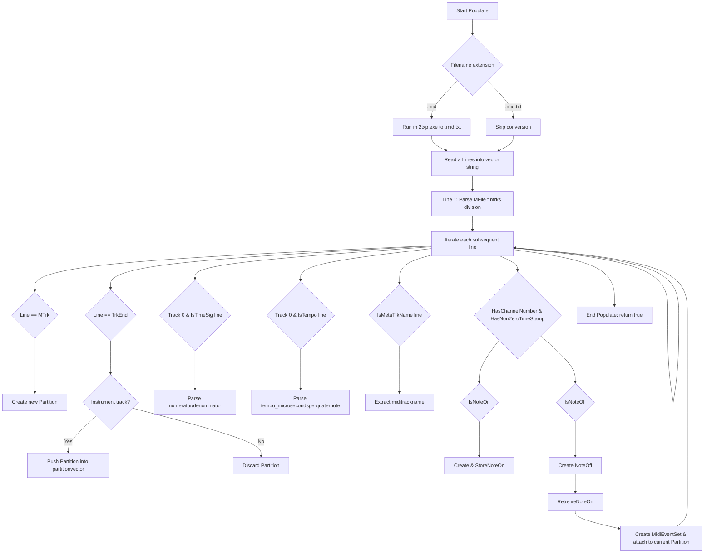

# MIDI-to-Audio: Partition and PartitionSet – Parsing MIDI Files into Partitions

This section describes how the library converts text-based MIDI dumps into structured **Partition** objects, each representing one instrument-bearing track. The core component is the **PartitionSet**, which orchestrates file conversion, line parsing, partition management, and event pairing.

## PartitionSet Overview

PartitionSet manages a collection of Partitions and all logic to parse a `.mid.txt` file into time-stamped events:

| Responsibility | Description |
| --- | --- |
| File conversion | Runs `mf2txp.exe` to produce a text dump if only `.mid` is provided |
| Header parsing | Reads MIDI format, track count, and division from the first line |
| Track identification | Detects `MTrk` and `TrkEnd` markers to start/end tracks |
| Global metadata | Extracts time signature and tempo from track 0 |
| Meta events | Captures `Meta TrkName` for human-readable track names |
| Event dispatch | Differentiates Note On/Off, timestamps, channel numbers, and builds `MidiEventSet` pairs |
| Partition assembly | Creates one `Partition` per instrument track and populates its `midieventsetvector` |


**PartitionSet class declaration** (spiws_partitionset.h)  :

```cpp
class SPIWAVSETLIB_API PartitionSet {
public:
    // MIDI file header
    int mfile_format, mfile_ntrks, mfile_division;
    // Global time signature
    int timesig_numerator, timesig_denominator;
    int timesig_midiclockspermetronomeclick;
    int timesig_numberofnotated32ndnotesperquaternote;
    // Tempo in μs per quarter note
    float tempo_microsecondsperquaternote;
    // Resulting Partitions
    std::vector<Partition*> partitionvector;
    // Temporary storage for Note On events
    std::vector<MidiEvent*> tempmidieventvector;

    PartitionSet();
    ~PartitionSet();

    // Main parsing entry point
    bool Populate(const char* midifile);

    // Line classification helpers
    bool IsStandardMidiFile(const char* filename);
    bool IsStandardMidiFileTxt(const char* filename);
    bool HasChannelNumber(std::string line);
    bool HasNonZeroTimeStamp(std::string line);
    bool IsTimeSig(std::string line);
    bool IsTempo(std::string line);
    bool IsMetaTrkName(std::string line);
    bool IsNoteOn(std::string line);
    bool IsNoteOff(std::string line);

    // Event creation and pairing
    MidiEvent* CreateMidiEventNoteOn(std::string line);
    MidiEvent* CreateMidiEventNoteOff(std::string line);
    void StoreNoteOn(MidiEvent* noteOn);
    MidiEvent* RetreiveNoteOn(MidiEvent* noteOff);

    // Other playback and timing methods omitted...
};
```

## Parsing Flowchart



## Detailed Steps in `Populate`

```cpp
bool PartitionSet::Populate(const char* midifile) {
    string input = midifile, output = input + ".txt";

    // 0) Convert .mid → .mid.txt if needed
    if (IsStandardMidiFile(input.c_str())) {
        string cmd = "mf2txp.exe \"" + input + "\" \"" + output + "\"";
        system(cmd.c_str());
    } else {
        assert(IsStandardMidiFileTxt(input.c_str()));
    }

    // 1) Load text lines
    vector<string> lines;
    ifstream ifs(output.c_str());
    string tmp;
    while (getline(ifs, tmp))
        lines.push_back(tmp);

    Partition* current = nullptr;
    int lineNum = 0, midiTrackCount = 0;
    bool inMidiTrack = false, inInstrumentTrack = false;

    for (auto& line : lines) {
        ++lineNum;

        // Parse header
        if (lineNum == 1) {
            // e.g. "MFile 1 11 96"
            sscanf(line.c_str() + 6, "%d %d %d",
                   &mfile_format, &mfile_ntrks, &mfile_division);
            continue;
        }

        // Track start
        if (line == "MTrk") {
            inMidiTrack = true;
            current = new Partition;
            continue;
        }

        // Track end
        if (line == "TrkEnd" && inMidiTrack) {
            ++midiTrackCount;
            if (inInstrumentTrack) {
                partitionvector.push_back(current);
            } else {
                delete current;
            }
            inMidiTrack = inInstrumentTrack = false;
            continue;
        }

        // Global time signature (track 0)
        if (IsTimeSig(line) && midiTrackCount == 0) {
            // Parse strings like "0 TimeSig 4/4 96 8"
            // … populate timesig_numerator, timesig_denominator, …
            continue;
        }

        // Global tempo (track 0)
        if (IsTempo(line) && midiTrackCount == 0) {
            // Parse "0 Tempo 500000"
            continue;
        }

        // Track name
        if (IsMetaTrkName(line)) {
            // Extract between quotes
            current->miditrackname =
              line.substr( /* … */ );
            continue;
        }

        // Instrument-bearing event
        if (HasChannelNumber(line) && HasNonZeroTimeStamp(line)) {
            inInstrumentTrack = true;

            if (IsNoteOn(line)) {
                auto* on = CreateMidiEventNoteOn(line);
                StoreNoteOn(on);
            }
            else if (IsNoteOff(line)) {
                auto* off = CreateMidiEventNoteOff(line);
                auto* on = RetreiveNoteOn(off);
                if (on) {
                    auto* pair = new MidiEventSet(on, off);
                    current->midieventsetvector.push_back(pair);
                }
                else {
                    // unmatched NoteOff — safely skip
                }
            }
        }
    }

    return true;
}
```

## Helper Methods in PartitionSet

| Method | Purpose |
| --- | --- |
| IsStandardMidiFile | File ends with `.mid` |
| IsStandardMidiFileTxt | File ends with `.mid.txt` |
| HasChannelNumber | Detects `"ch="` substring |
| HasNonZeroTimeStamp | First character != `'0'` |
| IsTimeSig | Line starts with `"0 TimeSig"` |
| IsTempo | Line starts with `"0 Tempo"` |
| IsMetaTrkName | Line starts with `"0 Meta TrkName"` |
| IsNoteOn | Contains `"On ch="` without `" v=0"` |
| IsNoteOff | Contains `"Off ch="` or `"On ... v=0"` |
| CreateMidiEventNoteOn/NoteOff | Instantiate and parse a `MidiEvent` from a line |
| StoreNoteOn | Push Note On into `tempmidieventvector` |
| RetreiveNoteOn | Match Note Off to its Note On, remove it from the temp vector |


> **Key points** - **Partition creation** begins at each `"MTrk"` and ends at `"TrkEnd"`. - **Track 0** is reserved for **global metadata** (time signature and tempo). - Only partitions containing **time-stamped channel events** become instrument tracks. - **Note On** events are buffered in `tempmidieventvector`; **Note Off** events pair with their matching Note On via `RetreiveNoteOn()` .

These helpers isolate text-matching logic and allow **Populate** to remain a clear, linear process.

## Partition Class Role

Each **Partition** encapsulates a single track’s sequence of `MidiEventSet` objects:

```cpp
class SPIWAVSETLIB_API Partition {
public:
    std::string miditrackname;            // From Meta TrkName
    std::string partitionname;            // Track name + assigned instrument
    std::vector<MidiEventSet*> midieventsetvector;
    WavSet* pWavSet;                      // Generated audio buffer

    Partition();
    ~Partition();

    float GetLengthInMidiClockTicks();
    // ... playback and wavset creation methods ...
};
```

Partitions serve as the building blocks for later audio synthesis: once parsed, each Partition can have its events transformed into a `WavSet`, summed into silence buffers, and scheduled for playback.

---

By following this design, the library cleanly separates **file parsing** (PartitionSet) from **audio buffer assembly** (Partition and WavSet), facilitating maintainability and future extensions.