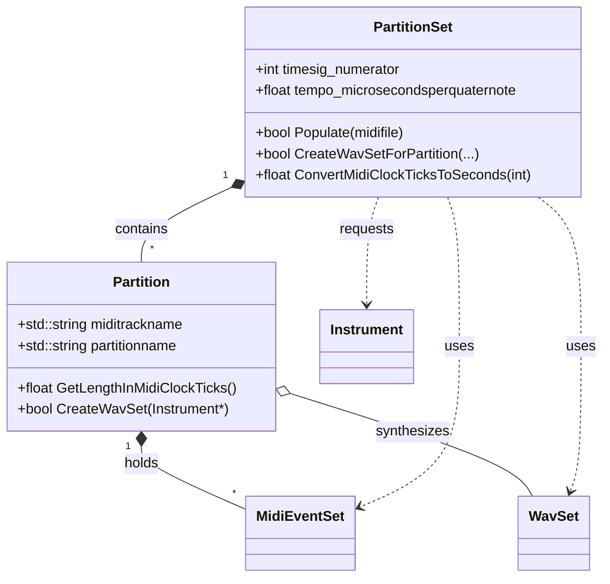

# MIDI-to-Audio: Partition and PartitionSet – Partition Model

This section describes how a single MIDI track is represented as a **Partition**, how multiple partitions are managed by a **PartitionSet**, and how MIDI events are transformed into audio buffers. Together, these classes underpin the library’s ability to synthesize and play back MIDI-based "wav sets."

---

## Partition Class 🎹

A **Partition** encapsulates one MIDI track’s worth of musical material. It collects note events, computes durations, and holds the synthesized audio buffer for that track.

```cpp
class SPIWAVSETLIB_API Partition {
public:
    std::string miditrackname;                  // Name from the MIDI Meta TrkName
    std::string partitionname;                  // Descriptive name plus instrument
    std::vector<class MidiEventSet*> midieventsetvector;  // Paired NoteOn/NoteOff events
    class WavSet* pWavSet;                      // Synthesized audio buffer

    Partition();
    ~Partition();

    float GetLengthInMidiClockTicks();
    bool CreateWavSet(class Instrument* pInstrument);
    void Play(struct PaStreamParameters* pPaStreamParameters);
    void LaunchScheduledPlay(int usingflag);
};
```

Properties and their roles:

| Property | Type | Description |
| --- | --- | --- |
| **miditrackname** | `std::string` | Parsed track name from “0 Meta TrkName” event |
| **partitionname** | `std::string` | Generated by appending instrument name to track name |
| **midieventsetvector** | `std::vector<MidiEventSet*>` | Each entry pairs a NoteOn and NoteOff into a `MidiEventSet` |
| **pWavSet** | `WavSet*` | Holds the final audio for the partition, built via `CreateWavSet` |


Key methods:

- **GetLengthInMidiClockTicks()**

Returns the partition’s total duration in MIDI clock ticks, based on the last `MidiEventSet` .

- **CreateWavSet(Instrument\*)**

Delegates to `PartitionSet::CreateWavSetForPartition` to build a `WavSet` by creating silence, summing each note’s audio, and naming the partition .

- **Play(PaStreamParameters\*)**

Streams `pWavSet` via PortAudio.

- **LaunchScheduledPlay(int)**

Exports `pWavSet` to a WAV file and invokes an external player (sox or spiplay).

---

## PartitionSet Class 🗂️

A **PartitionSet** manages a collection of partitions parsed from a MIDI file, handles time conversions, and orchestrates audio synthesis and playback.

```cpp
class SPIWAVSETLIB_API PartitionSet {
public:
    // MIDI file metadata
    int mfile_format, mfile_ntrks, mfile_division;
    int timesig_numerator, timesig_denominator;
    int timesig_midiclockspermetronomeclick;
    int timesig_numberofnotated32ndnotesperquaternote;
    float tempo_microsecondsperquaternote;

    std::vector<class Partition*> partitionvector;     // All partitions
    std::vector<class MidiEvent*> tempmidieventvector; // Temp storage for pairing events

    PartitionSet();
    ~PartitionSet();

    bool Populate(const char* midifile);
    // MIDI text parsing helpers...
    void StoreNoteOn(class MidiEvent*);
    class MidiEvent* RetreiveNoteOn(class MidiEvent*);
    bool CreateWavSetForPartition(class Partition*, class Instrument*, float);
    float GetTempoInBPM();
    float ConvertMidiClockTicksToSeconds(int midiclockticks);
    float GetLengthInSeconds(class Partition*);
    float GetStartTimeStampInSeconds(class MidiEventSet*);
    // Playback
    void Play(struct PaStreamParameters*, class InstrumentSet*, float);
};
```

### Responsibilities

- **MIDI Parsing**
- `Populate()` converts a `.mid` to text, reads lines, identifies tracks, and builds partitions by pairing NoteOn/NoteOff into `MidiEventSet` .
- **Timing Utilities**
- **GetTempoInBPM()** computes BPM from `tempo_microsecondsperquaternote`.
- **ConvertMidiClockTicksToSeconds()** translates clock ticks to seconds using tempo and PPQ .
- **GetLengthInSeconds(Partition\*)** and **GetStartTimeStampInSeconds(MidiEventSet\*)** wrap the above conversions.
- **Audio Construction**
- **CreateWavSetForPartition()**
- **Silence**: Creates a `WavSet` of silent frames of partition length.
- **Synthesis**: For each `MidiEventSet`, requests a note buffer from `Instrument::GetWavSetFromMidiNoteNumber`, then sums it into silence at the correct offset and duration.
- **Naming**: Sets `partitionname = miditrackname + instrumentname` .
- **Playback Coordination**
- **Play()** iterates partitions, assigns instruments, synthesizes each `pWavSet`, and calls `Partition::LaunchScheduledPlay`.

---

## Class Diagram



---

## Example Workflow

```cpp
PartitionSet ps;
ps.Populate("song.mid");                        // Parse MIDI into partitions
InstrumentSet instruments; 
instruments.Populate("instruments/");           // Load sample instruments

PaStreamParameters paOut = /* ... */;
float playbackDuration = 120.0f;

ps.Play(&paOut, &instruments, playbackDuration);  // Synthesize & play all partitions
```

---

```card
{
    "title": "Partition Naming",
    "content": "After synthesis, each Partition.partitionname is set by appending the Instrument name to the original MIDI track name."
}
```