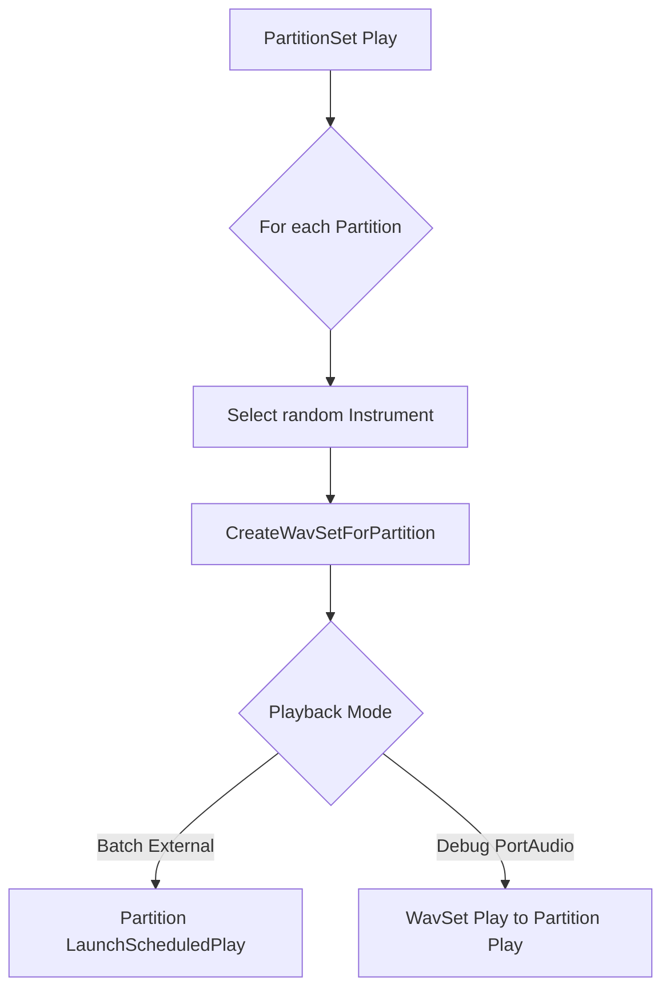

# MIDI-to-Audio: Partition and PartitionSet – Playing Partitions and PartitionSets

This section describes how MIDI events are rendered into audio buffers and played back, either via external tools (SoX, spiPlay) or directly through PortAudio. The key classes are **Partition** (represents a single MIDI track segment) and **PartitionSet** (manages a collection of partitions extracted from a MIDI file).

---

## Partition: Scheduled External Playback

A **Partition** holds one track’s worth of MIDI events and a corresponding `WavSet` that contains the rendered audio. Its main playback method, `LaunchScheduledPlay`, writes the `WavSet` to disk and invokes an external player based on the chosen flag:

```cpp
void Partition::LaunchScheduledPlay(int playerflag);
```

This method:

- Constructs a temporary filename:

```cpp
  std::string filename = "temp_partition_" + partitionname + ".wav";
```

- Writes the buffer to disk:

```cpp
  pWavSet->WriteWavFile(filename.c_str());
```

- Determines how long to play:

```cpp
  float seconds = pWavSet->GetWavSetLength();
```

- Invokes one of two external tools:

| **Player Flag** | **Command Template** | **Description** |
| --- | --- | --- |
| `USING_SOX` | `start [opts] C:\app-bin\sox\sox.exe [quiet] "filename.wav" -d repeat 1` | Play via SoX<br/>quiet, background |
| `USING_SPIPLAY` | `start [opts] C:\app-bin\spiplay\spiplay.exe "filename.wav" {seconds}` | Play via spiPlay<br/>background |


> Example: Calling SoX playback ```bash start /b C:\app-bin\sox\sox.exe -q "temp_partition_MyTrack.wav" -d repeat 1 ```

---

## PartitionSet: Batch and Debug Playback

A **PartitionSet** represents an entire MIDI file broken into multiple `Partition` objects. Its two-step rendering-and-playback process is:

1. **Render** each `Partition` into a `WavSet` using a randomly selected instrument.
2. **Play** all partitions either simultaneously via external tools or, in debug mode, sequentially via PortAudio.

### 1. Rendering Partitions

```cpp
bool PartitionSet::CreateWavSetForPartition(Partition* pPartition,
                                            Instrument* pInstrument,
                                            float numberOfSeconds);
```

- **Silence buffer** creation to cover the partition’s duration.
- **Summation** of each `MidiEventSet` onto that buffer at the correct offset.
- **Naming** the partition’s `WavSet` after its MIDI track and instrument.

### 2. Playback Strategies

```cpp
void PartitionSet::Play(PaStreamParameters* paParams,
                        InstrumentSet* instrumentSet,
                        float numberOfSecondsInPlayback);
```

Upon invocation, `PartitionSet::Play`:

- Logs the number of instruments available.
- Iterates each `Partition` in `partitionvector`.
- For **batch auditioning** (default):
- Picks a **random** `Instrument`.
- Calls `CreateWavSetForPartition`.
- Immediately triggers **simultaneous** external playback:

```cpp
    pPartition->LaunchScheduledPlay(USING_SOX);
```

- For **debug mode** (when toggled off):
- Renders once per instrument.
- Plays back via PortAudio:

```cpp
    pPartition->pWavSet->Play(paParams);
    pPartition->Play(paParams);
```

---

## Playback Flowchart



---

## Key Points

- **Fast Batch Auditioning** 📢

Simultaneous external playback enables quick comparison of all partitions with randomized instrumentation.

- **Per-Partition Debugging** 🔍

Sequential PortAudio playback allows detailed testing of timing, mixing, and individual instrument sounds.

- **Extensibility**

Flags `USING_SOX` and `USING_SPIPLAY` can be extended to other players (e.g., ASIO streams) by adding cases in `LaunchScheduledPlay`.