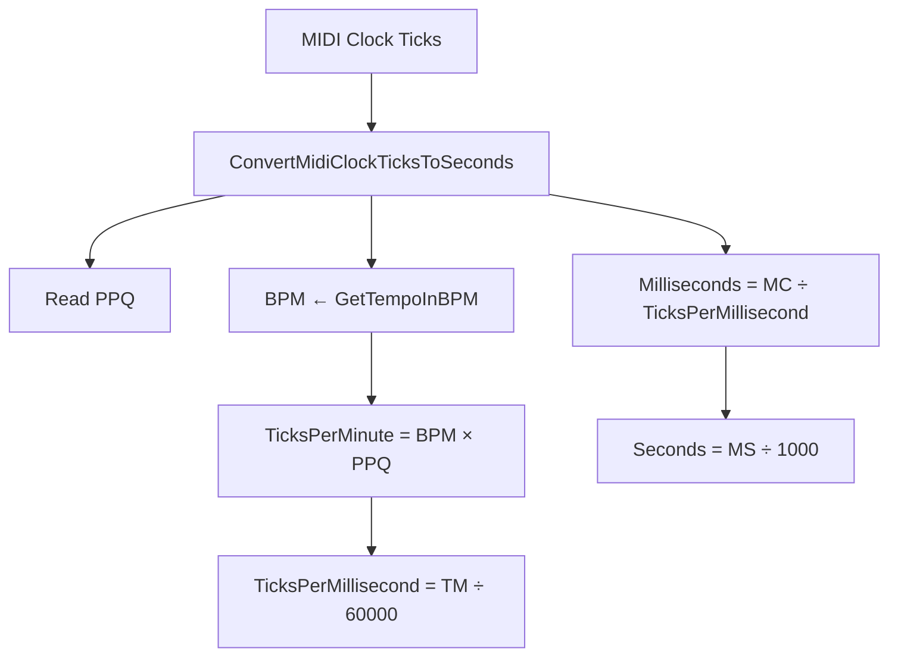

# MIDI-to-Audio: Partition and PartitionSet – Timing and Duration Computation

PartitionSet provides utilities to translate MIDI timing data (ticks) into real-time (seconds). These helpers compute tempo, convert clock ticks, and measure durations for each partition or event set. The results determine the length of generated WavSets and inform external players (sox, spiplay) during playback.

## PartitionSet Responsibilities

PartitionSet parses a Standard MIDI File into one or more `Partition` objects. It then:

- Stores global MIDI timing settings (division, time signature, tempo)
- Converts MIDI clock ticks into seconds
- Computes start times, end times, and lengths for partitions and event sets
- Supplies real-time durations to WavSet creation and playback routines

## Tempo and Clock Division 📐

PartitionSet holds MIDI header values needed for timing conversion.

| Property | Meaning | Source |
| --- | --- | --- |
| `tempo_microsecondsperquaternote` (float) | Microseconds per quarter-note (µs) | Header parsed from “0 Tempo” meta event |
| `timesig_midiclockspermetronomeclick` (int) | Pulses per quarter-note (PPQ) | Computed from “TimeSig” meta event |
| `timesig_numberofnotated32ndnotesperquaternote` (int) | Number of notated 32nd-notes per quarter | Time signature details |
| `mfile_division` (int) | MIDI division field (ticks per quarter) | MFile header |


## Method Summary

| Method | Parameters | Returns | Description |
| --- | --- | --- | --- |
| **GetTempoInBPM** | ― | `float` | Compute BPM from µs-per-quarter-note. |
| **ConvertMidiClockTicksToSeconds** | `int midiClockTicks` | `float` seconds | Map ticks to seconds using PPQ and current tempo. |
| **GetStartTimeStampInSeconds** | `MidiEventSet*` | `float` | Convert event-set start tick to seconds. |
| **GetEndTimeStampInSeconds** | `MidiEventSet*` | `float` | Convert event-set end tick to seconds. |
| **GetLengthInSeconds()** | ― | `float` seconds | Find maximum partition duration across all partitions. |
| **GetLengthInSeconds(Partition*)** | `Partition*` | `float` seconds | Get duration of a single partition. |
| **GetLengthInSeconds(MidiEventSet*)** | `MidiEventSet*` | `float` seconds | Get duration of one event-set. |


## GetTempoInBPM

Compute beats per minute from the stored microseconds per quarter-note:

```cpp
float PartitionSet::GetTempoInBPM() {
    // BPM = 60,000,000 µs per minute ÷ µs per quarter-note
    return 60000000.0f / tempo_microsecondsperquaternote;
}
```

This yields the **tempo** in BPM, foundational for all tick-to-time conversions .

## ConvertMidiClockTicksToSeconds

Translate MIDI clock ticks into real time:

```cpp
float PartitionSet::ConvertMidiClockTicksToSeconds(int midiClockTicks) {
    float ppq = timesig_midiclockspermetronomeclick;        // ticks per quarter-note
    float ticksPerMinute = GetTempoInBPM() * ppq;           // ticks in one minute
    float ticksPerMillisecond = ticksPerMinute / 60000.0f;  // ticks in one ms
    float milliseconds = midiClockTicks / ticksPerMillisecond;
    return milliseconds / 1000.0f;
}
```

Steps:

1. **PPQ**: pulses per quarter-note (`timesig_midiclockspermetronomeclick`)
2. **Ticks/minute**: `BPM × PPQ`
3. **Ticks/ms**: divide by 60,000
4. **Convert**: `ticks → ms → seconds`



## Start & End Time Stamps

**GetStartTimeStampInSeconds** and **GetEndTimeStampInSeconds** wrap above conversion for a `MidiEventSet`:

```cpp
float PartitionSet::GetStartTimeStampInSeconds(MidiEventSet* ev) {
    return ConvertMidiClockTicksToSeconds(ev->GetStartTimeStampInMidiClockTicks());
}

float PartitionSet::GetEndTimeStampInSeconds(MidiEventSet* ev) {
    return ConvertMidiClockTicksToSeconds(ev->GetEndTimeStampInMidiClockTicks());
}
```

Use these to schedule each note within a partition .

## GetLengthInSeconds

- **Global** (no args): iterate all `Partition*` and return the maximum duration.

```cpp
float PartitionSet::GetLengthInSeconds() {
    float maxSec = 0.0f;
    for (auto p : partitionvector) {
        float dur = GetLengthInSeconds(p);
        if (dur > maxSec) maxSec = dur;
    }
    return maxSec;
}
```

- **Partition** overload: computes length by end-tick of last `MidiEventSet`:

```cpp
float PartitionSet::GetLengthInSeconds(Partition* p) {
    return ConvertMidiClockTicksToSeconds(p->GetLengthInMidiClockTicks());
}
```

- **EventSet** overload: ensures a minimum length (0.5 s for debugging), then converts:

```cpp
float PartitionSet::GetLengthInSeconds(MidiEventSet* ev) {
    float sec = ConvertMidiClockTicksToSeconds(ev->GetLengthInMidiClockTicks());
    return (sec < 0.5f ? 0.5f : sec);
}
```

These functions determine buffer sizes when creating WavSets and durations passed to players .

## Integration with Rendering & Playback

1. **WavSet Creation**: silence buffer length ← `GetLengthInSeconds(Partition*)`.
2. **Summation**: each `MidiEventSet` mapped onto the WavSet at offset ← `GetStartTimeStampInSeconds(ev)` for duration ← `GetLengthInSeconds(ev)`.
3. **Playback**: final WavSet length guides external player repeat/duration parameters (sox, spiplay).

By centralizing all timing conversions in `PartitionSet`, the library ensures accurate alignment of audio samples to the original MIDI score.