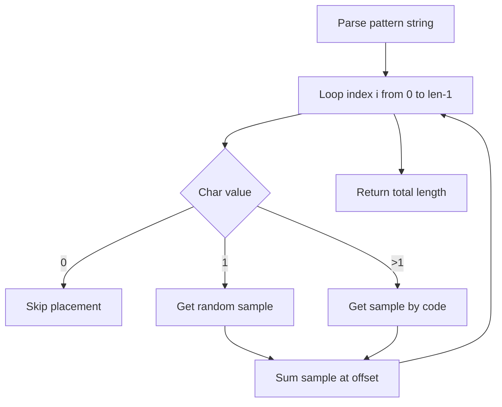

# WavSet: Audio Buffer and Operations

WavSet encapsulates a floating-point audio buffer with metadata such as sample rate and channel count. It provides **high-level composition** and **pattern-based mixing** methods to build complex audio timelines from short samples, enabling algorithmic arrangement and rendering of MIDI‐driven instruments.

## Composing and Mixing WavSets

WavSet supports three core composition operations:

- **🧩 Concatenate**: append one buffer to another
- **🎛️ Mix**: blend two buffers with per-input amplitude
- **➕ Sum**: overlay a slice of a buffer at a specific time

### Concatenate

Appends the samples of another WavSet to the end of the current buffer, reallocating memory as needed.

| **Signature** | **Description** |
| --- | --- |
| `bool Concatenate(WavSet* pWavSet);` | Append `pWavSet` samples to `this` buffer. |


**Behavior**

- If `this->pSamples` is non-null, it uses `realloc` to grow the buffer by `pWavSet->numBytes`, then `memcpy` to append data.
- Updates `totalFrames`, `numSamples`, and `numBytes`.
- If buffer is empty, falls back to `Copy(pWavSet)` .

```cpp
WavSet* lead = new WavSet();
lead->ReadWavFile("lead.wav");
WavSet* tail = new WavSet();
tail->ReadWavFile("tail.wav");

lead->Concatenate(tail);  // lead now contains lead.wav followed by tail.wav
```

---

### Mix

Combines two WavSets into one, scaling each input by a specified amplitude.

| **Signature** | **Description** |
| --- | --- |
| `bool Mix(float amp1, WavSet* pW1, float amp2, WavSet* pW2);` | Allocate a buffer sized to the longer input, then mix samples. |


**Behavior**

- Validates both inputs and ensures they share sample rate and channels.
- Allocates new `pSamples` of length equal to the longer WavSet.
- For each overlapping sample index, computes:

```plaintext
  this->pSamples[i] = amp1*pW1->pSamples[i] + amp2*pW2->pSamples[i];
```

- Ignores any trailing samples beyond the shorter input.

```cpp
WavSet track1, track2, result;
track1.ReadWavFile("piano.wav");
track2.ReadWavFile("strings.wav");

result.Mix(0.7f, &track1, 0.5f, &track2);
// result now holds a balanced blend of piano and strings
```

---

### Sum

Overlays a **slice** of another WavSet onto the current buffer at a given offset and duration.

| **Signature** | **Description** |
| --- | --- |
| `bool Sum(float amp, WavSet* pWavSet, float offset_s, float dur_s);` | Mix a segment of `pWavSet` into `this` buffer. |


**Behavior**

- Calculates overlap between the current buffer and the source segment defined by `offset_s` and `duration_s`.
- Computes sample-level start/end indices:

```cpp
  int start = offset_s * SampleRate * numChannels;
  int end   = min(start + dur_s*SampleRate*numChannels, numSamples);
```

- Adds `amp * pWavSet->pSamples[...]` to each sample in the overlapping region.

```cpp
WavSet mainTrack, snare;
mainTrack.CreateSilence(5.0f);        // 5 seconds of silence
snare.ReadWavFile("snare.wav");

mainTrack.Sum(0.8f, &snare, 1.2f, 0.5f);
// Places a 0.5s snare hit at 1.2s into mainTrack
```

---

## Pattern-Based Distribution

WavSet provides high-level methods to **spread** short samples across a timeline, either with simple spacing or driven by pattern strings.

### SpreadSample (count-based) 🔀

Evenly distributes a fixed number of sample instances over a duration.

| **Signature** | **Description** |
| --- | --- |
| `float SpreadSample(int count, WavSet* pWavSet, float dist_s, float dur_s, float offset_s, float amp);` | Place `count` instances of `pWavSet` over `dist_s` seconds. |


**Behavior**

- For `i` in `[0 … count-1]`, computes center offset:

```plaintext
  offset = offset_s + dur_s/2 + i*(dist_s/count);
  Sum(amp, pWavSet, offset, dur_s);
```

- Returns the time of the last sample’s end.

```cpp
WavSet track, hiHat;
track.CreateSilence(8.0f);
hiHat.ReadWavFile("hihat.wav");

// Place 16 hi-hat hits over 8 seconds
float totalLength = track.SpreadSample(16, &hiHat, 8.0f, 0.1f, 0.0f, 0.5f);
```

---

### SpreadSample (binary-pattern) 🟢⚪

Uses a `"1"`/`"0"` string to include or skip sample placements.

| **Signature** | **Description** |
| --- | --- |
| `float SpreadSample(const char* pattern, WavSet* pWavSet, float dist_s, float dur_s, float offset_s, float amp);` | Map `"1"`→place, `"0"`→skip across the pattern length. |


**Behavior**

- Parses each character; on `"1"` it calls `Sum` at calculated offset; on `"0"` it skips.
- Fails (`assert`) if any character is not `"0"` or `"1"`.

```cpp
track.CreateSilence(4.0f);
WavSet kick; kick.ReadWavFile("kick.wav");

// Play kick on every other step
track.SpreadSample("10101010", &kick, 4.0f, 0.2f, 0.0f, 1.0f);
```

---

### SpreadSamples (instrument-pattern) 🎯

Extends pattern strings beyond binary, selecting specific samples from an Instrument.

| **Signature** | **Description** |
| --- | --- |
| `float SpreadSamples(const char* pattern, Instrument* inst, float dist_s, float dur_s, float offset_s, float amp);` | Map each digit >1 to a WavSet via `inst->GetWavSetFromPatternCode`; `"1"`→random pick; `"0"`→skip. |


**Behavior**

- For each non-zero digit `d`, retrieves `WavSet* = inst->GetWavSetFromPatternCode(d)`.
- For `"1"`, uses `inst->GetWavSetRandomly()`.
- Calls `Sum` for each placed sample.
- Returns total timeline length.

```cpp
WavSet groove;
groove.CreateSilence(6.0f);
Instrument drumKit = LoadDrumKit("drumset.json");

// Pattern digits map to samples within drumKit
groove.SpreadSamples("20310230", &drumKit, 6.0f, 0.15f, 0.0f, 0.8f);
```

---

## Pattern-Processing Flow



This flowchart illustrates how `SpreadSamples` parses a pattern, selects or skips samples, and calls `Sum` to render them in time.

---

**Card Block: Key Takeaway**

```card
{
    "title": "Pattern Mixing",
    "content": "SpreadSample and SpreadSamples enable algorithmic, text-driven audio arrangement."
}
```