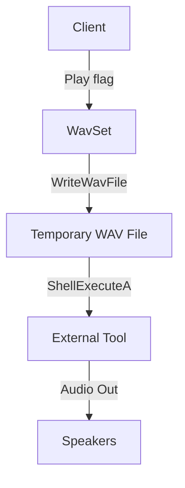

# WavSet: Audio Buffer and Operations – Playback and Streaming

WavSet encapsulates a floating-point audio buffer and provides versatile playback options. You can stream audio in-process via PortAudio or delegate playback to external tools like SoX and spiplay. This flexibility supports both real-time integration and off-line testing, visualization, or debugging.

## Embedded Playback 🎧

Embedded playback leverages PortAudio for cross‐platform, low-latency streaming. WavSet manages its own `PaStream` handle internally or allows you to open/close streams explicitly.

### Play Entire Buffer

Streams the full audio buffer in a blocking call.

```cpp
bool Play(PaStreamParameters* pPaStreamOutputParameters);
```

- Opens a PortAudio stream with:
- **Sample rate** = `SampleRate`
- **Frames per buffer** = `WAVSET_PLAY_BUFFERSIZE / numChannels`
- **No callback** (uses blocking API)
- Starts, writes all samples, and closes the stream
- Prints status messages via `StatusAddText`

### Play with Duration Limit

Creates a truncated copy of the buffer and streams up to `maxduration_s` seconds.

```cpp
bool Play(PaStreamParameters* pPaStreamOutputParameters,
          float maxduration_s);
```

- Internally:
- Allocates a temporary `WavSet`
- Copies `maxduration_s` seconds from `this`
- Calls the single-argument `Play` on the copy
- Ensures you never exceed a desired playback length

### Explicit Stream Management

For real-time engines, you can manage streams manually.

```cpp
bool OpenStream(PaStreamParameters* pPaStreamInputParameters,
                PaStreamParameters* pPaStreamOutputParameters,
                PaStreamCallback* pPaStreamCallback);

bool CloseStream();
```

- **OpenStream**
- Asserts no existing stream
- Calls `Pa_OpenStream(&pPaStream, input, output, SampleRate, numSamplesPerSegment/numChannels, paClipOff, callback, this)`
- On success, retains `pPaStream` for writes
- **CloseStream**
- Calls `Pa_CloseStream(pPaStream)` and releases it
- Use these when you need continuous, callback-driven audio I/O

## External Playback 🔊

Delegate playback to established command-line players. WavSet writes itself to disk and invokes the chosen tool.

### Play via External Tool

```cpp
bool Play(int usingflag,
          float numberofsecondsinplayback = -1.0f);
```

- Writes audio to a WAV file named by `wavsetname`
- Launches an external player via `ShellExecuteA` (or `system` in debug)
- Supported flags:

| Flag | Macro | Invocation Example |
| --- | --- | --- |
| **SoX** | `USING_SOX` (1) | `"sox.exe" "<filename>" -d trim 0 <seconds>"` |
| **spiplay** | `USING_SPIPLAY` (2) | `"spiplay.exe" "<filename>" <seconds>"` |
| **spispectrumplay_asio** | `USING_SPISPECTRUMPLAY` (3) | `"spispectrumplay_asio.exe" "<filename>" <seconds> 200 200 0 \"E-MU ASIO\""` |
| **spiplaystream_asio** | `USING_SPIPLAYSTREAM` (4) | `"spiplaystream_asio.exe" "<filename>" <seconds> \"E-MU ASIO\" 6 7"` |
| **spiplayx** | `USING_SPIPLAYX` (5) | `"spiplayx.exe" "<filename>" <seconds>"` |


### Workflow



## Usage Examples

### Embedded Playback

```cpp
#include "portaudio.h"
#include "spiws_WavSet.h"

// Initialize PortAudio...
PaStreamParameters outputParams = {/* ... */};
WavSet ws;
ws.ReadWavFile("kick.wav");
ws.Play(&outputParams);      // Streams the entire buffer
ws.Play(&outputParams, 0.5f); // Streams first 0.5 seconds
```

### External Playback

```cpp
#include "spiws_WavSet.h"

WavSet ws;
ws.ReadWavFile("snare.wav");
ws.SetName("snare.wav");       // Ensure name matches output file
ws.WriteWavFile("snare.wav");
ws.Play(USING_SOX, 2.0f);      // Launches SoX for 2 seconds
```

## When to Use Which Mode

> Note: These flags are defined in **spiws_WavSet.h** .

- **Embedded (PortAudio)**
- Low-latency, integrated audio
- Automated testing, interactive apps
- **External (SoX/spiplay)**
- Quick visualization and debugging
- Leverage existing toolchains for filters/spectra

---

This section empowers you to seamlessly integrate high-fidelity WAV playback into C++ applications, whether you need in-process streaming via PortAudio or rapid off-line playback with command-line utilities.