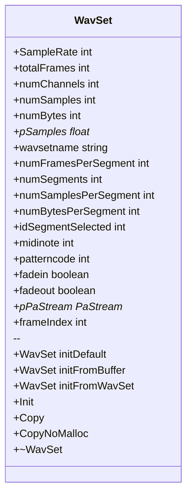

# WavSet: Audio Buffer and Operations

WavSet encapsulates a multi-channel audio buffer with sample data, playback state, segmentation info, and musical metadata. It provides flexible constructors for empty initialization, wrapping existing buffers, or copying subsets. WavSet plays central role in creating, transforming, and streaming WAV audio in the library.

## WavSet Data Model 📦

The **WavSet** class represents a floating-point audio buffer with descriptive and playback metadata. It owns its sample memory and tracks both static properties (sample rate, channels) and dynamic state (current playback frame).

### Core Attributes

| **Field** | **Type** | **Description** |
| --- | --- | --- |
| **SampleRate** | int | Number of samples per second |
| **totalFrames** | int | Frame count (one sample per channel per frame) |
| **numChannels** | int | Channels: 1 (mono) or 2 (stereo) |
| **numSamples** | int | `totalFrames × numChannels` |
| **numBytes** | int | `numSamples × sizeof(float)` |
| **pSamples** | float * | Pointer to buffer of interleaved samples |
| **wavsetname** | std::string | Optional human-readable name for this WavSet |
| **numFramesPerSegment** | int | Frames in each segment after segmentation |
| **numSegments** | int | Total segments after calling `SplitInSegments` |
| **numSamplesPerSegment** | int | Samples per segment (`numFramesPerSegment × numChannels`) |
| **numBytesPerSegment** | int | Bytes per segment (`numSamplesPerSegment × sizeof(float)`) |
| **idSegmentSelected** | int | Index of current segment (–1 if none selected) |
| **midinote** | int | MIDI note value (0–127) |
| **patterncode** | int | Optional code or ASCII pattern (0–255) |
| **fadein**, **fadeout** | bool | Flags to apply fade at segment edges |
| **pPaStream** | PaStream * | PortAudio stream pointer for callback-driven playback |
| **frameIndex** | int | Next sample frame to output in callback |


These fields form the backbone of WavSet’s capabilities and link audio data to playback and higher-level sequencing .

## Memory Ownership and Lifespan

Every WavSet instance **owns** its buffer at `pSamples`. Memory is allocated or freed internally:

- On **initialization**, `pSamples` is set to `NULL`.
- Constructors or methods like `CreateSilence()` allocate `pSamples`.
- The **destructor** (`~WavSet`) frees allocated memory.

Proper use of Copy vs. CopyNoMalloc ensures efficient reuse or dedicated allocation.

## Constructors & Copying

WavSet offers several ways to build or duplicate buffers:

- **Default Constructor**

Initializes all metadata to zero or sentinel values and sets `pSamples` to `NULL`.

```cpp
  WavSet::WavSet() { Init(); }
```

Internally resets fields in `Init()` .

- **Buffer-Wrapping Constructor**

```cpp
  WavSet(int samplerate, int numchannels, int totalframes, float* psamples);
```

Adopts an existing `psamples` buffer without copying. Asserts valid channels and pointer .

- **Copy-by-Segment Constructor**

```cpp
  WavSet(WavSet* pWavSet, int idSegment = -1);
```

Duplicates all (or a single segment if `idSegment ≥ 0`) from another WavSet. Frees any preexisting buffer and allocates new memory .

- **Copy Methods**
- `Copy(WavSet* pWavSet, int idSegment = -1)`
- `Copy(WavSet* pWavSet, float duration_s, float offset_s)`
- `Copy(WavSet* pWavSet, int duration_frame, int offset_frame)`

Perform deep copies, optionally constrained to time windows or segments.

- **CopyNoMalloc Methods**

```cpp
  bool CopyNoMalloc(WavSet* pWavSet, int duration_frame, int src_offset_frame, int dst_offset_frame);
```

Overwrite existing buffer without reallocating, for in-place mixing or streaming.

## Class Diagram



This diagram highlights key properties and methods without parameter clutter.

## Practical Example

```cpp
#include "spiws_WavSet.h"

// 1) Create 2-second stereo silence at 44 100 Hz
WavSet silence;
silence.CreateSilence(2.0f, 44100, 2);

// 2) Load a WAV file
WavSet clip;
if (clip.ReadWavFile("kick.wav")) {
    clip.SetMidiNote(36);
    clip.SetPatternCode(65); // ASCII 'A'
}

// 3) Extract first half-second segment
WavSet hit(&clip, /*idSegment*/ 0);
hit.SplitInSegments(0.5);
```

This workflow shows common initialization, file I/O, metadata tagging, and segmentation use.